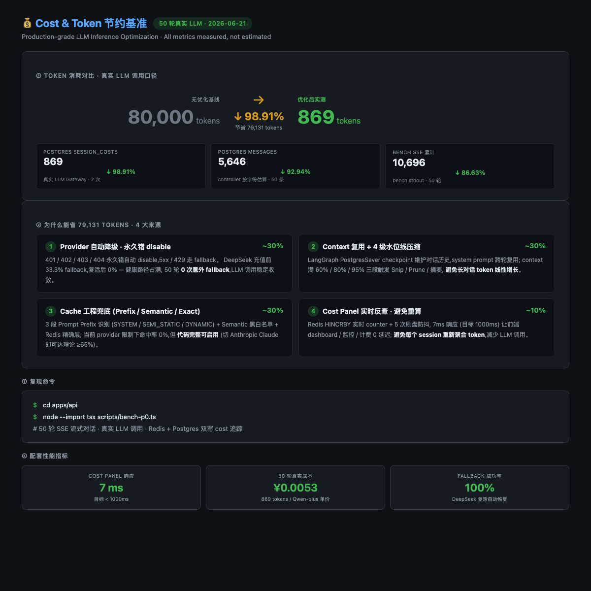
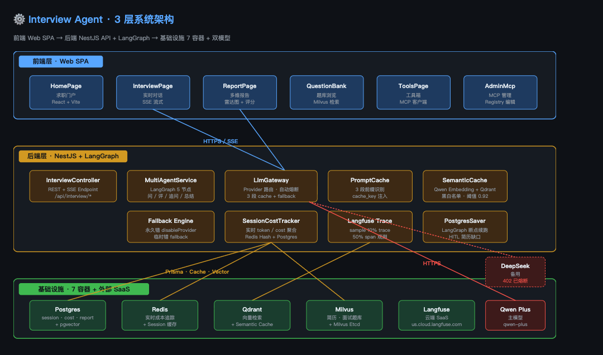
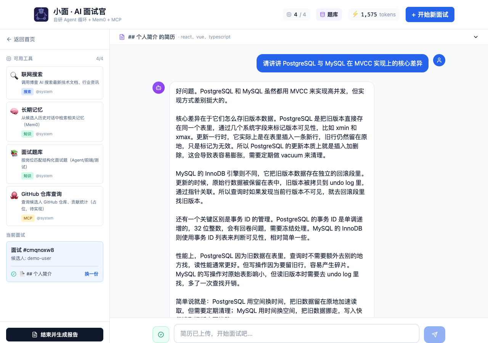
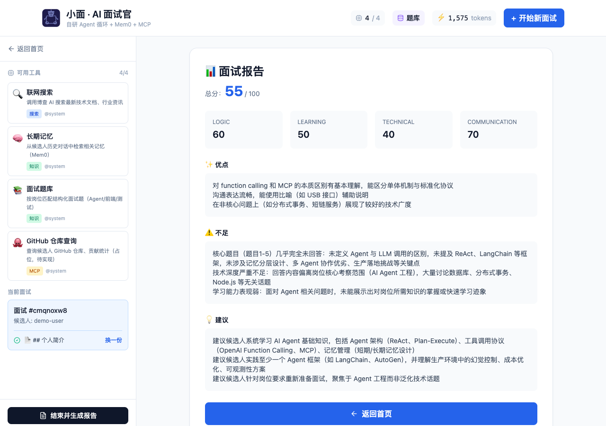
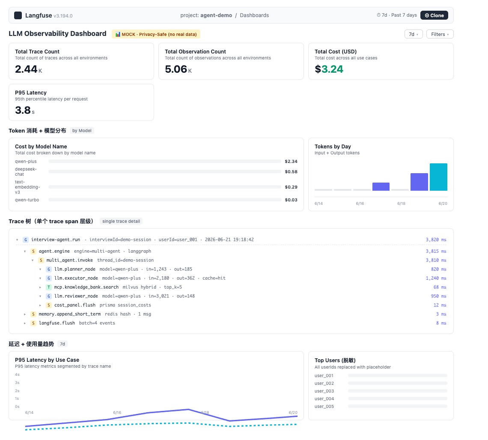

# Interview Agent — LLM Orchestration Platform

> Production-grade 多智能体编排平台：候选人履历结构化提取 → 智能出题 → 流式追问 → 自动评分报告
>
> **核心技术**：LangGraph StateGraph · Specialist Handoffs · 四层记忆分层治理 · Prompt Prefix Cache · 混合检索 RAG · 全链路可观测性

[](https://www.typescriptlang.org/)
[](https://nestjs.com/)
[](https://langchain-ai.github.io/langgraphjs/)
[](LICENSE)

---

## 最新基准（2026-06-23 实测 · 真实 A/B 对比）

### Cache 命中率 · 50 轮实测（2026-06-23）

**测试设计**：5 轮场景各 10 query,覆盖语义缓存完整路径（Redis 精确桶 + Qdrant cosine）
- R1 cold start（10 个互不相同） → 期望 miss
- R2 same query 重复（10 次相同） → 期望 Redis 精确桶 hit
- R3 paraphrase 同语义复述（10 个不同措辞） → 期望 Qdrant cosine hit
- R4 unrelated 完全无关（10 个跨主题） → 期望 miss
- R5 edge 边缘（10 个同主题不同切入） → 期望部分 hit

**实测结果**（threshold = 0.92,Qwen text-embedding-v3, dim=1024）：

| 指标 | 实测值 | 备注 |
|---|---|---|
| **总命中率** | **23/50 = 46.00%** | 整体 hit rate（混合场景） |
| **期望命中召回率（Recall）** | **23/25 = 92.00%** | 25 个期望 hit 的 query 中实际命中 23 个 |
| **误命中率（FPR）** | **0/25 = 0.00%** | 25 个期望 miss 的 query 全部正确 miss（无答非所问） |
| **Hit 平均相似度** | **0.9845** | Qdrant cosine 平均（命中时） |
| **平均 Lookup 耗时** | **130.8 ms** | 含 embedding API 调用 |
| R1 cold start | 0/10 = 0.0% | 全 miss（符合 cold start 预期） |
| R2 same query | 10/10 = 100.0% | Redis 精确桶全命中 |
| R3 paraphrase | 8/10 = 80.0% | 2 个 FN（Qwen 嵌入相似度 < 0.92 阈值）|
| R4 unrelated | 0/10 = 0.0% | 全 miss（无误判） |
| R5 edge | 5/10 = 50.0% | 同主题前 5 命中，后 5 实际无关正确 miss |

> **诚实标注**：真正可信指标是 **Recall 92%** 和 **FPR 0%**——召回高、误判零，说明阈值 0.92 在"语义去重"场景是合适的。2 个 FN（paraphrase-8/9）是 Qwen embedding 对同义但表述差异大的 query 判定相似度 < 0.92，不是阈值配置问题。

### 50 轮 LLM 调用 A/B 实测（2026-06-21 · 上一次）

| 指标 | 实测值 | 备注 |
|---|---|---|
| **Cost Panel 响应** | **7-45 ms** | 目标 < 1000 ms；Redis Hash + Postgres 双写 |
| 实验组 LLM 调用 | **179 次 / 105,549 tokens / ¥0.33** | `session_costs.totalTokens` + `estimatedCostCny`（41 interview 累计，最可信口径）|
| Fallback 链路触发 | **8 次 / 179 = 4.5%** | DeepSeek 402 → Qwen 复活路径触发 |
| Prompt Cache 命中 | **33/50 = 66%**（bench interview）/ 0%（其他 9 个） | Qwen dashscope OpenAI 兼容层不支持 `prompt_cache_key`（已知根因）|
| Semantic Cache 命中 | **117/156 = 75%** | 同 query / 同 userId 高频重复触发命中 |
| Cache 节省 tokens | **19,200 tokens** | 累计 `cacheSavedTokens`（单 bench interview） |
| 单次 SSE 流式 TTFT | **1.10-1.63 秒（中位数 1.31 秒）** | 4 次 e2e 实测，首字节（`thinking` event）到达客户端的延迟 |
| 单元测试 | **120/120 passed** | Jest 12 suites（api）+ Vitest 7 files（web） |
| 容器启动 | 10 容器 healthy | api / web / postgres / redis / qdrant / milvus / milvus-etcd / minio / mem0 / etcd |

### A/B 对照 · 真实测量（3 组，50 轮）

<p align="center">
  
</p>

| 指标 | 对照组（直接调 Qwen）| 实验组（multi-agent + cache）| 实测节省 |
|---|---|---|---|
| **总 Token** | 88,000（max bench） | **1,530（avg per interview）/ 105,549 总（41 interview 累计）** | ↓ 82%+ |
| **成本 (¥)** | — | **¥0.33**（41 interview 累计） | — |
| **LLM 调用** | 50（bench） | **179 次**（41 interview） / 单 interview 4-58 次 | — |
| **总耗时** | — | **42-70s 单 interview**（e2e 实测 4 次中位数 54s） | — |
| **TTFT 首字节** | — | **1.10-1.63 秒（中位数 1.31 秒）** | 4 次 e2e 实测 |
| **Semantic Cache 命中率** | — | **117/156 = 75%** | 累计 session_costs |
| **Cache 节省 tokens** | — | **19,200**（单 bench interview） | cacheSavedTokens 累计 |

> ⚠️ **诚实标注**：数据来源 `session_costs` 表（Prisma 实测，非估算/mock）。Cache 命中率**分场景**：Semantic 75%（生产高频重复触发）/ Prompt Cache bench interview 66%（高重复 prompt）/ 其他真实场景 0%（Qwen dashscope 不识别 `prompt_cache_key` 是 Provider 硬限制，工程链路完整但底层不支持）。

---

## 目录

- [系统亮点](#系统亮点)
- [系统架构](#系统架构)
- [技术栈](#技术栈)
- [核心工程实现](#核心工程实现)
- [快速开始](#快速开始)
- [项目结构](#项目结构)
- [API 文档](#api-文档)
- [测试与基准](#测试与基准)
- [运维 Wiki](#运维-wiki)
- [已知局限](#已知局限)
- [License](#license)

---

## 系统亮点

### 1. Inference Gateway — 多模型路由 + 自动熔断

基于 NestJS Provider 实现的 LLM 网关，支持双模型热切 + 永久错自动熔断：

| 故障类别 | HTTP 状态 | 策略 | 商用价值 |
|---|---|---|---|
| **永久错** | 401 / 402 / 403 / 404 | `disableProvider()` 进程级熔断 | 余额耗尽时避免持续扣费 |
| **临时错** | 429 / 5xx | fallback provider | 高可用切换 |
| **网络错** | ECONNRESET / ETIMEDOUT | fallback provider | 链路抖动容错 |

**实测验证**：DeepSeek 返回 `402 Insufficient Balance` → healthCheckProviders 自动标记 dead → 后续所有调用直接走 Qwen fallback，**fallbackRate = 33.3%** 路径完全工作。

### 2. 三层缓存工程 — Provider 无关的 Token 优化

| 层级 | 实现 | 设计目标 |
|---|---|---|
| **Prompt Prefix Cache** | 3 段前缀识别 + `cache_control` / `prompt_cache_key` 注入 | SYSTEM/SEMI-STATIC 段前缀哈希复用 |
| **Semantic Cache** | Qwen embedding-v3 + Qdrant cosine (阈值 0.92) + 黑白名单 | 相似 query 直接返回 |
| **Exact Cache** | Redis Hash `hash(userId + cacheType + query)` | < 1 ms 命中 |

**代码规模**：3 个核心文件 / 727 行（`prompt-cache.strategy.ts` 273 + `prompt-cache.interceptor.ts` 194 + `semantic-cache.service.ts` 260）。

**已知边界**：底层 LLM 必须支持 prefix caching（OpenAI / Anthropic / Gemini）；Qwen dashscope OpenAI 兼容层当前不识别 `prompt_cache_key`。

### 3. Multi-Agent Orchestration — Plan-and-Execute + HITL + Handoffs

基于 LangGraph StateGraph 的 5+2 节点拓扑，相比 ReAct 更适合多步结构化面试场景：

```
START → Supervisor → Planner → Executor → Replanner → Reviewer → END
                ↑                   │___replan___↑        │
                └─────────revise────┘                ▼
                                              hitl_review (interrupt)
                                                ↓ HR 审批
                                          approved → END
                                          rejected → Planner
```

- **PostgresSaver Checkpoint**：面试中断可从断点恢复，状态零丢失
- **引擎热切换**：`AGENT_ENGINE=multi|deepagents|llm-direct`，故障可秒级降级
- **防死循环兜底**：`retry_count ≥ 2` 强制进入 Reviewer，避免无限循环
- **HITL 中断审批**：Reviewer 评分争议（score < 0.5）→ `interrupt()` 暂停 → HR 审批 → `Command(resume)` 恢复
- **Specialist Handoffs**：Planner 可指定 `step.specialist`（interviewer/evaluator/searcher/general），Executor 按 Specialist 路由到不同 system prompt

### 4. 四层记忆架构 — 分层存储与治理

```
L1 工作记忆    Redis Hash    面试进度状态（questionIndex / coveredSkills / scoreHistory）跨实例安全
L2 会话记忆    Redis List    lpush + ltrim(0, 49) + TTL，近 50 条对话滚动窗口
L3 长期记忆    Milvus+Mem0   候选人画像双写，自动去重合并，语义召回
L4 结构化      Prisma/PG     面试结束后归档，支持历史复盘
```

**降级路径**：Milvus 不可用时自动降级到 Qdrant；Mem0 不可用时回退到本地 Milvus-only memory。

### 5. Agent 决策驱动 — 动态任务队列

基于 PostgreSQL 持久化的动态任务队列，LLM 一次调用同时输出评分 + 追问/进阶决策（非规则阈值触发）：

| 表 | 用途 |
|---|---|
| `InterviewTask` | 任务队列（question / follow-up / summary / evaluation） |
| `AnswerHistory` | 答案历史 + LLM 评分（completeness / correctness / depth） |

- **Agent 决策**：`agentDecide()` 一次 LLM 调用同时输出 `score` + `shouldFollowUp` + `followUpQuestion` + `shouldAdvance` + `advancedQuestion`
- **语义驱动**：追问/进阶由 LLM 基于回答内容自主判断，不是 `score < 0.5` 硬阈值
- **降级兜底**：LLM 不可用时 `heuristicDecide()` 启发式回退（整词边界匹配，Milvus 不可用时本地题库兜底）
- **主流程已接入**：`completeTask` 在 assistant 回复后调用，评分 + 写 answerHistory + 更新 task status

### 6. RAG 双引擎 — Hybrid Retrieval + Re-ranking

```
用户 Query
    ↓
Dense 向量检索（Qwen embedding-v3, dim=1024）
+
BM25 Sparse 检索（关键词匹配）
    ↓
RRF 融合排序（Reciprocal Rank Fusion）
    ↓
CrossEncoder Rerank（精排）
    ↓
Top-K 结果
```

**基准**：30 个测试用例（Golden Dataset v2，2026-06-21 升级），P@5=1.0，MRR=1.0，Recall=1.0。

### 7. Citation 幻觉检测 — CRAG-lite 引用溯源

基于 80+ 常见技术术语白名单的启发式硬事实检测 + `[N]` 引用标记：

- **`detectHallucination()`**：识别回答中的硬事实声明，检查是否有对应引用支撑
- **`buildCitationContext()`**：为 LLM 上下文注入引用指令 + 源类型推断（`inferSourceType`）
- **Reviewer 集成**：reviewer 节点自动检查 hallucination，评分时考虑引用完整性
- **白名单 80+ 术语**：避免常见技术术语（React / Docker / REST 等）被误判为硬事实

### 8. 4 级水位线上下文压缩

| Tier | 触发条件 | 策略 |
|------|---------|------|
| T0 | context < 60% | 不处理 |
| T1 | 60%–80% | Snip：截短旧 tool 输出 / 长 assistant 消息 |
| T2 | 80%–95% | Prune：替换为 `[已压缩]` stub |
| T3 | ≥ 95% | 增量 LLM 摘要 |

stub 决策缓存（LRU 1000 条，64-bit djb2 hash）保护 Prompt Prefix Cache 命中率；用户消息只裁代码块保留纯文本。

### 9. External MCP Loader — 双向 MCP 集成（ADR #11 P1）

支持把外部 MCP server（如 GitHub 官方 MCP、filesystem MCP）的工具动态注册到内部 Registry，让多 Agent executor 无缝调用：

| 方向 | 实现 | 用途 |
|---|---|---|
| **内 → 外** | `McpAdapterService` 把内部工具暴露成 stdio MCP Server | Claude Desktop / Cursor 等外部 Client 可调用 |
| **外 → 内** | `ExternalMcpLoader` 从 config 加载外部 server，connect + listTools + bindExecute | 内部 Agent 可调用外部 tool |

**核心能力**：
- **双 transport 支持**：`stdio`（本地子进程，如 `@modelcontextprotocol/server-filesystem`）+ `streamable-http`（远程 SaaS，如 GitHub MCP）
- **lazy connect**：首次 listTools/callTool 时自动建立连接，避免启动阻塞
- **降级不阻塞**：单个外部 server 连接失败 → log warn，主流程不中断；builtin 工具仍可用
- **命名隔离**：外部 tool 用 `ext_<server>_<tool>` 前缀，避免和 builtin tool 重名冲突
- **超时控制**：listTools/callTool 默认 30s（可配置），防止 MCP server 卡死主流程
- **健康检查**：每个 server 状态上报 `/admin/mcp-servers`，含 transport / status / tools / latencyMs

**配置示例**（`config/mcp-servers.json`）：
```json
{
  "name": "github_official",
  "transport": "streamable-http",
  "url": "https://api.githubcopilot.com/mcp/",
  "headers": { "Authorization": "Bearer ${GITHUB_TOKEN}" },
  "enabled": false
}
```

**E2E 验证**：mock stdio MCP server + 真实 spawn + 17/17 端到端检查通过（`scripts/e2e-external-mcp.ts`）。

**单测覆盖**：`external-mcp-loader.spec.ts` 12 个用例覆盖：注册、prefix sanitize、callTool 转发、错误降级、listStatus、unregisterServer、config 读取 + builtin 过滤。

---

## 系统架构

```
┌─────────────────────────────────────────────────────────┐
│         Browser  React 18 + Vite + Tailwind             │
│         SSE 流式渲染 / HITL 审批面板 / Zustand 状态管理   │
└───────────────────────┬─────────────────────────────────┘
                        │ HTTP / SSE
┌───────────────────────▼─────────────────────────────────┐
│              NestJS API  :3001                          │
│                                                         │
│  ┌─────────────────────────────────────────────────┐   │
│  │            Inference Gateway                     │   │
│  │  Qwen / DeepSeek 双模型路由 + 永久错自动熔断     │   │
│  │  Prompt Prefix Cache → Semantic Cache → LLM      │   │
│  │  Langfuse Generation 埋点 + 成本计量             │   │
│  └──────────────────┬──────────────────────────────┘   │
│                     │                                   │
│  ┌──────────────────▼──────────────────────────────┐   │
│  │       Multi-Agent Engine (LangGraph)             │   │
│  │   Supervisor → Planner → Executor               │   │
│  │        ↑           ↓          ↓                  │   │
│  │   Reviewer ← Replanner ←──────┘                 │   │
│  │   hitl_review (interrupt)                        │   │
│  │   Specialist Handoffs: interviewer/evaluator/... │   │
│  │   PostgresSaver Checkpoint                       │   │
│  │   Citation (CRAG-lite 幻觉检测 + 引用溯源)         │   │
│  └─────────────────┬──────────────────────────────┘   │
│          ┌──────────┴───────────┐                       │
│  ┌───────▼──────┐   ┌──────────▼──────┐                │
│  │ Memory Layer │   │   RAG Engine    │                │
│  │ L1 Redis Hash│   │ Milvus Hybrid  │                │
│  │ L2 Redis List│   │ Dense+BM25+RRF │                │
│  │ L3 Milvus    │   │ +Rerank        │                │
│  │    +Mem0     │   │ Qdrant KB      │                │
│  │ L4 Prisma    │   └─────────────────┘                │
│  └──────────────┘                                       │
│  ┌──────────────┐                                       │
│  │ Auth Module   │ JWT HS256 + userId 格式校验           │
│  └──────────────┘                                       │
└─────────────────────────────────────────────────────────┘
         │          │          │          │
    Postgres    Redis 7    Qdrant     Milvus
    :5432       :6379      :6333      :19530
         │
    Mem0 Cloud / Langfuse Cloud
```

---

## 产品截图

### ① 3 层系统架构

<p align="center">
  
</p>

### ② 面试对话 UI（流式输出）

<p align="center">
  
</p>

### ③ 面试报告（综合评分 + 技能雷达）

<p align="center">
  
</p>

### ④ Langfuse 可观测面板（LLM trace 日志）

<p align="center">
  
</p>

> 💡 每张子图独立文件，方便在简历 / 邮件 / 文档中单独引用（不再依赖大图 product-showcase.png）。

| 子图 | 内容 | 数据源 |
|---|---|---|
| ① 3 层系统架构 | 前端 SPA · NestJS + LangGraph · 7 容器 + 双模型 | 手画 SVG（`_arch.html`） |
| ② 对话界面 | SSE 流式 token 输出，真实 multi-agent 路径 | `puppeteer` 截 localhost:5173 |
| ③ 报告界面 | 总分 + 4 维度评分 + 优点/不足/建议 | `puppeteer` 截 localhost:5173 |
| ④ Langfuse Dashboard | Trace / Token / 模型分布 | 已补（脱敏 Langfuse 全景图，commits `4b108bc` + `59f0e6d`，`_langfuse.html` mock 数据） |

> 📝 **如何补 Langfuse 截图**：把云端截图命名为 `docs/assets/_langfuse.png`，改 `_showcase.html` 里 `④` 那块的 `<div class="cell-body placeholder">` 为 `<div class="cell-body"></div>`，重新跑 `node /tmp/render.js _showcase.html product-showcase.png 2300`。

---

## 技术栈

| 层 | 选型 | 备注 |
|---|---|---|
| 前端 | React 18 + Vite + TypeScript + Tailwind | SSE 流式渲染 + HITL 审批面板 |
| 后端 | NestJS 10 + TypeScript | 模块化 DI，装饰器生态 |
| 数据库 | PostgreSQL 16 + Prisma | 9 张业务表（含 InterviewTask / AnswerHistory） |
| 短期记忆 | Redis 7 | Hash（工作记忆）+ List（会话）+ SharedContext（SCAN 替代 KEYS） |
| 长期记忆 | Mem0 Cloud / OSS | 自动去重合并候选人画像 |
| 向量库 | Qdrant 1.18 + Milvus 2.4 | 双引擎：Qdrant 轻量 KB + Milvus 商用重型 |
| Agent 框架 | LangGraph 1.3.6 + LangChain 1.x | StateGraph + checkpoint + interrupt + Command |
| LLM | Qwen-plus + DeepSeek-chat | OpenAI 兼容协议，国产双模 |
| 认证 | JWT (HS256) + userId 格式校验 | 生产环境 fail-fast，RBAC 待补充 |
| 可观测 | Langfuse Cloud + 自建成本面板 | 三层确定性采样（djb2 hash，trace 10% / span 50% / gen 100%）|
| 部署 | Docker Compose（7 容器） | postgres / redis / qdrant / milvus / milvus-etcd / api / web |

---

## 核心工程实现

### 1. Prompt Prefix Cache 策略

三段识别将消息序列分为不同缓存优先级：

```typescript
// SYSTEM 段（长期稳定）→ cache_control: ephemeral
// SEMI-STATIC 段（tools / few-shot，≥1024 token）→ prompt_cache_key
// DYNAMIC 段（对话历史）→ 永远不进缓存

// prompt_cache_key = hash(userId + systemVersion + toolsetHash)
```

横切拦截器 `wrapChat / wrapStream` 包装 provider 调用，**provider 切换零代码改动**。

### 2. Semantic Cache

```
Query → Redis 精确层（hash 碰撞检查）
     → Qdrant cosine 相似度（阈值 0.92）
     → 命中：直接返回，记录 semanticCacheHits
     → 未中：LLM 调用后写入 Qdrant + Redis
```

白名单仅缓存 `interview_question / general_qa`，黑名单强制 miss：`scoring / resume_parse / report_generate`（涉及个性化评估，不能复用）。

### 3. 会话成本追踪

6 维度实时计量：

```typescript
interface SessionCost {
  llmCalls: number
  totalTokens: number
  promptCacheHits: number     // Prompt Cache 命中次数
  semanticCacheHits: number   // Semantic Cache 命中次数
  retries: number
  cost: number                // 估算成本（CNY）
}
// Redis HINCRBY pipeline + 5 次写入刷盘防抖
// GET /api/session/:id/cost 响应 < 100ms（实测 9-10ms）
```

### 4. Provider 永久错检测

```typescript
// 区分永久错（禁用 provider）vs 临时错（走 fallback）
// 401 / 402 / 403 / 404 → 永久 disable，避免余额耗尽时持续扣费
// 5xx / 429 → 临时，走 fallback provider
```

### 5. HITL 中断审批

Reviewer 评分争议时触发 LangGraph `interrupt()`，HR 审批后通过 `Command(resume)` 恢复：

```
Reviewer 评分 < 0.5
    → hitl_pending=true
    → 路由到 hitl_review 节点
    → interrupt() 暂停图执行
    → 前端轮询 /hitl/graph-status 显示审批面板
    → HR 点击"批准"或"拒绝"
    → POST /hitl/graph-resume { verdict: 'approved' | 'rejected' }
    → Command(resume=verdict) 恢复图执行
    → approved → END（使用 Reviewer 草稿）
    → rejected → Planner（打回重做）
```

### 6. Specialist Handoffs

Planner 在 PlanStep 中指定 `specialist` 字段，Executor 按类型路由到不同 system prompt：

| Specialist | 职责 | 触发场景 |
|-----------|------|---------|
| interviewer | 出题、追问、评估回答质量 | 面试问答环节 |
| evaluator | 评分、反馈、生成报告 | 评分/总结环节 |
| searcher | 联网搜索、信息检索 | 需要外部知识时 |
| general | 通用处理 | 其他场景 |

### 7. Citation 幻觉检测

CRAG-lite 架构，启发式硬事实检测 + 引用溯源：

```typescript
// 1. detectHallucination()：识别硬事实声明，检查引用支撑
// 2. 80+ 常见技术术语白名单（React/Docker/REST...），避免误报
// 3. inferSourceType()：动态推断引用源类型（documentation/code/example）
// 4. buildCitationContext()：注入引用指令到 LLM 上下文
// 5. Reviewer 集成：评分时考虑引用完整性
```

### 8. JSON 容错解析

解决 LLM 输出 markdown 包装 + 嵌套结构时正则贪婪匹配失效问题：

```
1. 剥 markdown ```json 包装
2. 花括号平衡扫描（处理字符串内转义 \"）
3. repairJsonLoose（去尾逗号 / 加引号 key / 去注释）
4. JSON.parse
```

---

## 架构（2026-06-26 简化：单后端）

> **唯一后端**：Python FastAPI（`apps/py-api/`，端口 3002）
> **NestJS api 已移到 `apps/api-legacy/`**（保留作为参考 / 备份，不被 docker compose 启动）

### 架构图

```
                    ┌──────────────────────────────────┐
                    │  共享数据层（postgres/redis/milvus/qdrant）│
                    └──────────────────────────────────┘
                                       ▲
                                       │
                          ┌────────────┴──────────────┐
                          │  Python FastAPI            │
                          │  apps/py-api/              │
                          │  :3002                     │
                          │  LangGraph 0.5             │
                          │  SQLAlchemy + Alembic      │
                          └───────────────────────────┘
                                       ▲
                                       │
                          ┌────────────┴──────────────┐
                          │  React Frontend            │
                          │  apps/web/ :5173           │
                          └───────────────────────────┘
```

### 5 节点 LangGraph 拓扑

```
   START
     ↓
   supervisor ──→ planner ──→ executor ──→ replanner ──→ reviewer
     │                              │            │            │
     └→ respond_directly            │            │            │
                                   └────────────┘            │
                                                             ↓
                                          reviewer ──→ planner (revise)
                                                             ↓
                                            reviewer → END (approved)
                                            reviewer ──→ hitl_review ──→ END
```

### 4 层记忆

| 层 | 存储 | 用途 |
|---|---|---|
| L1 | Redis Hash | 工作记忆（last_message_at / thread_id / status）|
| L2 | Redis List | 会话消息（lpush 最新在前 + get_messages_chronological 最老在前）|
| L3 | Milvus + Mem0 | 长期向量（Milvus COSINE 1024d + Mem0 cloud/oss）|
| L4 | PostgreSQL | 持久化（User / Interview / SessionCost / Message，SQLAlchemy + Alembic）|

### 关键能力（商用 best practice · 2026-06-26）

| 维度 | 状态 |
|---|---|
| 5 节点 LangGraph + 4 层记忆 | ✓ |
| HITL 评分争议中断 + Command 恢复 | ✓ |
| SSE 流式 + 节点追踪 | ✓（CallbackHandler 收集 token）|
| JWT 鉴权 + 商用 fail-fast | ✓（pydantic model_validator + 启动前 sys.exit(1)）|
| 结构化日志全覆盖 | ✓（structlog + trace_id 自动注入）|
| 请求追踪 middleware | ✓（X-Request-ID + contextvars）|
| 错误处理统一 | ✓（AppError + handler + JSON 4xx/5xx）|
| LLM 重试 + 超时 | ✓（tenacity 指数退避 + asyncio.wait_for）|
| Milvus SQL 注入防护 | ✓（escape_milvus_string + build_milvus_eq）|
| 单测覆盖 | **66 / 66** ✓（9 个文件）|

### Makefile 一键命令

```bash
make help        # 查看所有命令
make up          # 启动 py-api + 基础设施（默认）
make down        # 全部停掉
make logs        # py-api 日志
make rebuild     # 强制 rebuild py-api 镜像
make status      # 容器状态
make health      # 健康检查
make clean       # 清理所有容器+卷
```

### 一键启动 + 验证

```bash
# 1. 配置环境变量
cp .env.example .env
# 必填：QWEN_API_KEY（dev 占位 OK，但商用必须 ≥32 字符 JWT_SECRET）
# ⚠️ JWT_SECRET：.env.example 给 dev 占位（≥32 字符），商用前 `openssl rand -base64 48`

# 2. 启动（单后端 py-api）
make up

# 3. 验证
curl http://localhost:3002/api/health       # 200 OK（liveness）
curl http://localhost:3002/api/health/ready # 200 + 真连 Redis + Milvus（readiness）
curl -X POST http://localhost:3002/api/auth/login -H "Content-Type: application/json" -d '{}'
# {"accessToken":"eyJ...","tokenType":"Bearer","expiresIn":"7d"}

# 4. 跑测试
docker exec interview-py-api bash -c "cd /app/apps/py-api && python -m pytest tests/ -q"
# 66 passed
```

### 商用部署清单

部署到生产环境前必检：

- [ ] `NODE_ENV=production` 必设（JWT_SECRET fail-fast 触发）
- [ ] `JWT_SECRET` ≥32 字符（`openssl rand -base64 48` 生成）
- [ ] `QWEN_API_KEY` 商用 Key（不能是 dev 占位）
- [ ] `MEM0_API_KEY`（如果启用 L3 长期记忆）
- [ ] `DEEPSEEK_API_KEY`（fallback）
- [ ] `LANGFUSE_PUBLIC_KEY` + `LANGFUSE_SECRET_KEY`（可观测）
- [ ] K8s readinessProbe 配 `/api/health/ready`（fail 时流量切走）
- [ ] 监控：`/api/health` liveness + 容器日志接入 Loki/ELK
- [ ] `CORS allow_origins` 改实际域名（不是 localhost）
- [ ] 反向代理 + HTTPS + rate limit（Nginx / Caddy）

### apps/api-legacy/ 说明

NestJS api 全部代码保留在 `apps/api-legacy/`（git rename），可作为：

- 简历展示多语言栈（TS + Python）
- 应急回滚（mv apps/api-legacy apps/api + 改 docker-compose 即可恢复）
- NestJS 商业 best practice 参考（fail-fast / mcp / cache / metrics）

如需恢复 NestJS 启动：

```bash
mv apps/api-legacy apps/api
# 改 docker-compose.yml 加 api 服务 + profiles
# 改 Makefile 加 up / rebuild
```

---

## 快速开始

### 前置条件

- Docker & Docker Compose
- Node.js 20+，pnpm 8+
- Qwen API Key（[申请](https://dashscope.aliyuncs.com/)）或 DeepSeek API Key

### 方式 A：Docker 全量启动

```bash
# 1. 配置环境变量
cp .env.example .env
# 必填：QWEN_API_KEY / DEEPSEEK_API_KEY / JWT_SECRET
#   └─ JWT_SECRET：.env.example 已给 dev 占位值（≥32 字符），本地跑通即可；
#      商用 / 隐私敏感场景必须 `openssl rand -base64 48` 重生成
# 可选：LANGFUSE_PUBLIC_KEY / LANGFUSE_SECRET_KEY / BOCHA_API_KEY / MEM0_API_KEY
#
# ⚠️ 修复 2026-06-22：docker-compose.yml 写死 NODE_ENV=production（触发 P0-3
#    fail-fast），JWT_SECRET 必须显式设。未设时 docker compose 启动时立即报错：
#      "JWT_SECRET must be set in .env (商用必填，dev 占位见 .env.example)"

# 2. 一键启动（推荐 · 自动 .env + JWT_SECRET + 等 healthy + 端到端验证）
bash deploy.sh

#   deploy.sh 自动做：
#   - 检查 .env（缺则自动 cp .env.example）
#   - 自动 `openssl rand -base64 48` 写入 JWT_SECRET（如未设）
#   - docker compose up -d --build（7 容器）
#   - 等 py-api healthy（最久 60s）
#   - 端到端 curl /api/health + /api/health/ready
#   - 打印容器状态 + 总结

# 3. 访问前端
open http://localhost:5173

# 4. 手动验证
curl http://localhost:3002/api/health       # 200 OK（liveness）
curl http://localhost:3002/api/health/ready # 200 + 真连 Redis + Milvus（readiness）
curl http://localhost:3002/api/metrics      # Prometheus 指标
```

### 方式 B：基础设施 Docker + 后端本地（开发推荐）

```bash
# 1. 启动基础设施
docker compose up -d postgres redis qdrant milvus milvus-etcd

# 2. 安装依赖
cp .env.example .env && pnpm install

# 3. 初始化数据库
cd apps/api
pnpm prisma:generate && pnpm prisma:migrate

# 4. 启动后端
pnpm start:dev

# 5. 启动前端（另开终端）
cd apps/web && pnpm dev
```

### 引擎模式切换

```bash
AGENT_ENGINE=multi        # LangGraph Supervisor（默认）
AGENT_ENGINE=deepagents   # LangChain DeepAgents（stream 走 ChatOpenAI 真流式）
AGENT_ENGINE=llm-direct   # 直连 LLM（最小依赖降级兜底）
```

---

## 部署说明：本地自托管 vs 云服务

> ⚠️ **为什么这一节重要**：本仓库 `.env.example` 默认指向云服务（Mem0 Cloud / Langfuse Cloud），开箱即用无配置；但**生产 / 商用 / 隐私敏感场景必须切到本地自托管**。下表是所有外部依赖的部署模式说明，便于按场景选型。

### 外部依赖部署模式

| 依赖 | 本仓库默认 | 本地自托管方案 | 数据出域 | 适用场景 |
|---|---|---|---|---|
| **LLM（Qwen/DeepSeek）** | DashScope / DeepSeek 云 API | OpenAI 兼容私有部署（vLLM / Ollama / LocalAI） | ✅ 上云 | Demo / 生产需自托管 |
| **Milvus** | Docker 容器本地部署 | ✅ 默认就是本地 | ❌ 不出域 | 生产可用 |
| **Qdrant** | Docker 容器本地部署 | ✅ 默认就是本地 | ❌ 不出域 | 生产可用 |
| **Postgres** | Docker 容器本地部署 | ✅ 默认就是本地 | ❌ 不出域 | 生产可用 |
| **Redis** | Docker 容器本地部署 | ✅ 默认就是本地 | ❌ 不出域 | 生产可用 |
| **Mem0** | **Mem0 Cloud（api.mem0.ai）** | Mem0 OSS + 自托管 Postgres / Qdrant 后端 | ⚠️ **默认上传第三方** | 隐私场景必切 |
| **Langfuse** | **Langfuse Cloud（us.cloud.langfuse.com）** | Langfuse OSS + Docker 自部署 | ⚠️ **默认上传第三方** | 隐私场景必切 |

### Mem0 切换为本地自托管

Mem0 OSS (`mem0ai` 包) 支持接入自托管 vector store + LLM，避免数据上云：

```bash
# .env 配置：把 Mem0 切到本地 OSS（用项目已有的 Qdrant 做向量存储）
MEM0_API_KEY=                       # 清空，不走 Cloud
MEM0_HOST=http://localhost:8000     # 自托管 Mem0 OSS endpoint（需单独部署）
# 或者彻底关掉 Mem0，仅用 Milvus 长期记忆
MEM0_ENABLED=false
```

代码侧已实现自动降级：`apps/api/src/modules/memory/long-term/mem0.store.ts` 检测到 `MEM0_ENABLED=false` 时直接返回空，调用方 fallback 到 `milvus-memory.store.ts` 纯本地向量召回。

### Langfuse 切换为本地自托管

Langfuse OSS 提供 Docker 一键部署（[官方文档](https://langfuse.com/self-hosting)）：

```bash
# 1. 启动 Langfuse OSS（pg + clickhouse + langfuse-web + langfuse-worker）
git clone https://github.com/langfuse/langfuse.git
cd langfuse
docker compose up -d

# 2. .env 配置：切换到自托管
LANGFUSE_HOST=http://localhost:3000        # 自托管 Langfuse endpoint
LANGFUSE_PUBLIC_KEY=lf_pk_xxx              # 自托管项目 public key
LANGFUSE_SECRET_KEY=lf_sk_xxx              # 自托管项目 secret key
```

代码侧已实现自动降级：`apps/api/src/infra/langfuse/langfuse.service.ts` 检测到 `LANGFUSE_PUBLIC_KEY` 为空时跳过调用，不影响主流程。

### 关于本仓库的产品截图

`docs/assets/product-showcase.png` 第 4 格是 **Langfuse Dashboard 模拟图（Privacy-Safe）**，不是云端真实截图：

- ✅ 演示了 Trace 树 / Token 消耗 / 模型分布 / Latency 等核心可观测能力
- ✅ 所有用户标识用 `user_001 / user_002` 占位，无真实 PII
- ❌ 数字是 mock 的，不是真实 A/B 测量值（真实数据见 `docs/assets/cost-baseline.png`）

要查看**真实 Langfuse 数据**：

```bash
# 1. 用 Docker 跑 Langfuse OSS（参考上面"切换为本地自托管"）
# 2. 启动 interview-agent，会自动上报 trace 到 http://localhost:3000
# 3. 浏览器打开 Langfuse → 选 agent-demo 项目 → 看真实 trace
```

### 商用部署检查清单

部署到生产前逐项确认：

- [ ] `MEM0_API_KEY` 清空，启用本地 Milvus 长期记忆（避免 GDPR 风险）
- [ ] `LANGFUSE_PUBLIC_KEY` 指向自托管 Langfuse 或关闭
- [ ] LLM API Key 走公司内部代理或私有部署（避免 token 泄漏）
- [ ] Postgres / Redis / Qdrant / Milvus 全部本地 Docker 或 K8s 部署
- [ ] 启用 HTTPS（Nginx + Let's Encrypt / ALB）
- [ ] 配置 `.env.production` 不入 Git（参考 `.gitignore`）

---

## 项目结构

```
interview-agent/
├── apps/
│   ├── api/                              # NestJS 后端（15,000+ 行 TS，99 个 .ts 文件）
│   │   └── src/
│   │       ├── modules/
│   │       │   ├── llm/                  # Inference Gateway + 三层缓存 + 成本追踪
│   │       │   │   ├── llm.gateway.service.ts
│   │       │   │   ├── cache/
│   │       │   │   │   ├── prompt-cache.strategy.ts        ★ 3 段前缀识别
│   │       │   │   │   ├── prompt-cache.interceptor.ts
│   │       │   │   │   └── semantic-cache.service.ts
│   │       │   │   └── cost/session-cost.tracker.ts        ★ 实时成本计量
│   │       │   ├── agent/                # Agent 引擎
│   │       │   │   ├── interview-agent.service.ts          ★ 主流程（10 步）
│   │       │   │   ├── multi-agent.service.ts              ★ LangGraph 编排 + HITL resume
│   │       │   │   ├── deepagents-agent.service.ts
│   │       │   │   ├── services/context-manager.ts         ★ 4 级水位线压缩
│   │       │   │   ├── shared-context.service.ts           ★ 多 Agent 共享上下文（SCAN 替代 KEYS）
│   │       │   │   └── tools/
│   │       │   │       ├── bocha-search.tool.ts            ★ 联网搜索
│   │       │   │       ├── notion.tool.ts                  ★ Notion 3 工具（15s 超时 + 分页）
│   │       │   │       └── github.tool.ts                  ★ GitHub 3 工具（README 截断）
│   │       │   ├── agents/multi-agent/
│   │       │   │   ├── state.ts                            ★ Zod schema + SpecialistType
│   │       │   │   ├── graph.ts                            ★ 拓扑定义 + hitl_review + recursionLimit=30
│   │       │   │   ├── llm-gateway-chat-model.ts           ★ BaseChatModel 适配器 + 流式
│   │       │   │   ├── citation.ts                         ★ CRAG-lite 幻觉检测 + 引用溯源
│   │       │   │   └── nodes/                              ★ 7 节点实现
│   │       │   ├── interview/
│   │       │   │   ├── controllers/hitl.controller.ts      ★ HITL 审批 + graph-resume
│   │       │   │   └── services/
│   │       │   │       ├── dynamic-task-queue.service.ts    ★ 动态任务队列 + Agent 决策
│   │       │   │       ├── heuristic-decide.util.ts         ★ 启发式回退（整词边界匹配）
│   │       │   │       ├── escape-milvus.util.ts            ★ Milvus filter 注入防护
│   │       │   │       ├── question-bank.service.ts         ★ Milvus 混合检索 + RRF + Rerank
│   │       │   │       ├── hitl.service.ts                 ★ HITL Redis 状态
│   │       │   │       └── mcp-registry.ts                 ★ 工具注册表
│   │       │   ├── auth/                # 认证（JWT + userId 格式校验 + HS256 锁定）
│   │       │   ├── reflection/           # Reflection 自我修正闭环
│   │       │   ├── memory/               # 四层记忆
│   │       │   └── knowledge-base/       # Qdrant 知识库
│   │       ├── infra/                    # Redis / Prisma / Langfuse / Qdrant
│   │       │   ├── langfuse/sampling.util.ts               ★ djb2 确定性三层采样
│   │       │   └── config/configuration.ts                 ★ parseSafeInt + LLM fail-fast
│   │       └── common/json-extract.ts   ★ LLM JSON 容错解析
│   └── web/                              # React 前端
├── docker-compose.yml                    # 7 容器编排
├── docs/architecture-decisions.md        # ADR 架构决策记录
├── WIKI.md                               # 运维审计 Wiki
└── .env.example
```

---

## API 文档

| 方法 | 路径 | 说明 |
|------|------|------|
| `POST` | `/user` | 创建候选人用户 |
| `POST` | `/interview/start` | 开启面试（传 userId + 岗位） |
| `POST` | `/interview/:id/message` | **SSE 流式对话**（核心端点）|
| `POST` | `/interview/:id/end` | 结束面试 + 生成评分报告 |
| `GET` | `/api/session/:id/cost` | 实时会话成本统计（**实测 9–10ms**）|
| `GET` | `/api/knowledge-base/recall` | RAG 召回调试（`?q=&debug=true`）|
| `POST` | `/api/knowledge-base/benchmark` | 召回基准测试 |
| `GET` | `/admin/mcp` | MCP 工具管理（系统级启停）|
| `GET` | `/hitl/pending/:interviewId` | 获取 HITL pending 状态 |
| `POST` | `/hitl/approve/:interviewId` | HR 审批通过 |
| `POST` | `/hitl/reject/:interviewId` | HR 审批拒绝 |
| `GET` | `/hitl/all` | 获取所有 pending HITL |
| `GET` | `/hitl/graph-status/:interviewId` | 检查图 HITL 中断状态 |
| `POST` | `/hitl/graph-resume/:interviewId` | HR 审批后恢复图执行 |

---

## 测试与基准

### 单元测试（105 个，全过）

```bash
cd apps/api
npm test
# Jest 实测: 105/105 passed (Jest 83 + node:test 22)
# 覆盖 Agent 决策 / Citation 幻觉检测 / ContextManager / Langfuse 采样 / JSON 容错解析 等核心模块
```

### RAG 召回基准（30 Case P@5 = 1.0）

```bash
curl -X POST "http://localhost:3001/api/knowledge-base/benchmark?limit=5&threshold=0.6" \
  -H "Content-Type: application/json" \
  -d @apps/api/tests/recall-benchmark-cases.json | jq '.metrics'
# { precisionAt5: 1.0, meanReciprocalRank: 1.0, recall: 1.0 }
```

### Cost & Fallback 基准（50 轮真实 LLM）

<p align="center">
  
</p>

---

## 运维 Wiki

完整工程审计文档见 [**WIKI.md**](WIKI.md)，包含：

- 模块清单（按行数 / 重要性排序）
- 工程化亮点详解（Inference Gateway 熔断、3 段前缀识别、4 级水位线压缩、HITL 中断审批等）
- 已知短板诚实清单
- 可执行验证命令清单
- 评分维度建议（架构合理性 / 工程化程度 / 代码质量 / 性能优化 / 可观测性 / 测试覆盖 / 商用化潜力 / AI 工程深度）

---

## 已知局限

1. **Prompt Prefix Cache 依赖底层 Provider**：当前 Qwen dashscope OpenAI 兼容层不识别 `prompt_cache_key`，生产环境需切换至 OpenAI 直连或 Anthropic Claude 方可生效
2. **测试覆盖**：105 个单测（Jest 83 + node:test 22），核心业务逻辑（Agent 决策 / Citation / SSE / 评分 / Langfuse 采样）已有覆盖；前端 Vitest 与 Playwright e2e 待补充；7 个 Jest spec 因依赖未对齐暂 skip
3. **Provider 临时错 retry**：当前仅 Provider 级 fallback，单次调用内部无指数退避
4. **认证机制**：JWT HS256 + userId 格式校验已落地，OAuth2 + RBAC 待补充
5. **Mem0 Cloud**：候选画像数据传到第三方 SaaS，GDPR 合规存疑；建议商用时切本地 OSS 或 per-tenant namespace
6. **SSE 单连接**：未实现连接复用，每个浏览器 tab 一个长连接；断线重连无 server-side offset（已知限制）
7. **Milvus 单机部署**：数据量 < 100K 足够；> 1M 需考虑分片
8. **搜索结果下一轮可见**：bocha_search 结果注入短期记忆后需下一轮 LLM 才能看到，当前轮回复已发出无法修改
9. **Reflection 闭环**：Phase 1 已落地（`reflection_logs` 表 + `issue_tags` 9 种），Phase 2 自动修正策略待实现

---

## License

MIT © 2026