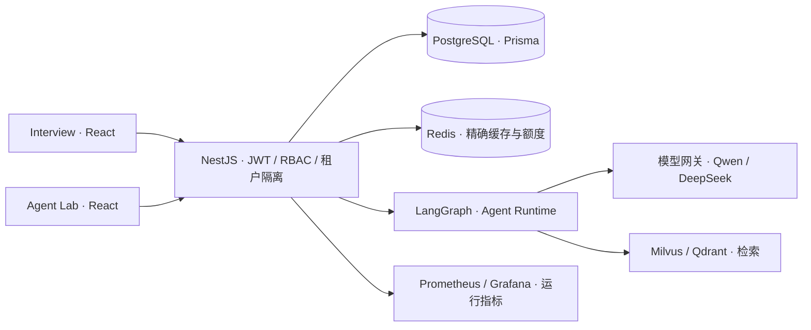

# Interview Agent / Agent Lab

**面试训练工作台 · 可追溯的 Agent 运行与受控评测**

[](https://github.com/zhangjizhe/interview-agent/actions/workflows/ci-api.yml)
[](LICENSE)

Interview 连接目标岗位、简历、模拟面试、报告与训练入口。Agent Lab 管理版本、运行证据、题库和评测，在人工批准后才允许已通过证据门的版本作用于 Interview。两端采用暖灰画布、白色面板和靛蓝操作色，清晰区分候选人与管理员的工作空间。

> **交付状态 · 2026-10-08**：本地工程与浏览器验收通过。真实业务版本对比尚未通过；生产环境部署与商用验收尚未完成。本文中的测试数量是实际执行结果，录制数据与合成场景不代表真实模型效果。

[交付报告](docs/DELIVERY-REPORT-2026-10-08.md) · [开发入口](AGENTS.md) · [当前状态](docs/project/CURRENT_STATE.md) · [待办](docs/project/TASKS.md) · [能力边界](docs/agent-lab-status.md)


实际页面：发布门 REJECT，费用按已核验小计展示，管理员发布禁用。截图中的历史原始分数不能作为有效发布依据。

## 两个工作空间

| 工作空间 | 当前实现 | 证据边界 |
| --- | --- | --- |
| Interview | 登录、岗位版本、简历导入、流式面试、报告、证据与训练入口 | 浏览器认证与岗位流程使用真实 API；报告呈现另有合成 fixture 验证。完整训练复测效果未验收 |
| Agent Lab | ADMIN 门禁、题库治理、MCP、Trace、录制报告、版本与受控自进化 | 录制报告的 APPROVE 只记录人工决定；Agent 版本另受真实发布证据门约束 |
| 评测任务 | PostgreSQL 持久化、202 回执、幂等键、租约、真实进度与失败费用小计 | 崩溃不会自动付费重放；未知费用不能记为零，预算是样本边界软停止 |
| 模型与缓存 | Qwen / DeepSeek 网关、额度预留、成本证据、完整请求精确缓存 | Lab 评测绕过答案缓存；尚无本版净成本降低或质量改善结论 |

## 架构


```mermaid
flowchart LR
  I[Interview · React] --> A[NestJS · JWT / RBAC / 租户隔离]
  L[Agent Lab · React] --> A
  A --> P[(PostgreSQL · Prisma)]
  A --> R[(Redis · 精确缓存与额度)]
  A --> G[LangGraph · Agent Runtime]
  G --> M[模型网关 · Qwen / DeepSeek]
  G --> V[Milvus / Qdrant · 检索]
  A --> O[Prometheus / Grafana · 运行指标]
```

采用 React + NestJS + Prisma 的模块化单体。`apps/py-api` 是实验性替代实现，不属于默认产品路径。数据库迁移由独立 migration 服务执行，成功后 API 才启动；readiness 校验 PostgreSQL、Redis 与所需迁移，不能替代全链路健康证明。

## 快速开始

准备 Docker Desktop / Compose。源码开发使用 Node.js 20 与 pnpm 9.0.0。

```bash
cp .env.example .env
openssl rand -base64 48
```

将随机值填入 `.env` 的 `JWT_SECRET`，配置有效 `QWEN_API_KEY`；`DEEPSEEK_API_KEY` 为可选备用 Provider。通过 `ADMIN_USER_IDS` 指定受控管理员身份。模型流程需要有效额度，首次启动的 Provider 健康探测也可能产生调用；不要提交 `.env`。已有数据库升级前先备份，并在隔离环境验证恢复。

```bash
docker compose up -d --build
```

| 入口 | 本地地址 |
| --- | --- |
| Interview | http://localhost:5173 |
| Agent Lab | http://localhost:5175 |
| API | http://localhost:3001/api |
| 存活 / 就绪 | http://localhost:3001/api/health · http://localhost:3001/api/health/ready |

Compose 的数据库、缓存与向量服务配置用于开发验收。公网部署前需完成凭据、网络、TLS、备份及安全剩余项治理，不能直接将本地端口配置用作生产基线。

## 本版验证

| 验证 | 2026-10-08 实际结果 |
| --- | --- |
| API Jest（含真实 Redis、multipart 与依赖补丁回归） | 626 通过；17 项数据库测试由专用步骤单独执行 |
| PostgreSQL：新库、旧库升级及租户/额度/评测任务 | 17 通过 |
| 缓存单元 / Web 与 Lab 组件 | 22 / 95 通过 |
| lint / 类型检查 / 生产构建 | 通过；lint 0 warning |
| API、Interview、Lab Docker 镜像 | 构建成功并在本机启动 |
| 实际 API 镜像 smoke | 12/12 通过；独立 PG/Redis/Milvus，网络阻断外部 Provider |
| 真实 API 浏览器认证、岗位、权限与移动端 | 24/24 通过 |
| Lab ADMIN / USER 门禁与录制报告流程 | 通过；录制 fixture 不是模型质量证据 |
| 合成 Golden Dataset 格式 | 30 Cases 校验通过 |
| 数据库备份恢复 | 隔离恢复后 schema 与所有业务表行数一致 |

完整证据及安全剩余项见[交付报告](docs/DELIVERY-REPORT-2026-10-08.md)。GitHub Actions 验证锁文件安装、严格 lint、类型、测试、数据库升级和三个镜像；远端实际结果以 Actions 与 PR 为准。本地通过不等于远端 CI 通过。

```bash
pnpm install --frozen-lockfile
pnpm db:generate
pnpm lint --max-warnings 0
pnpm typecheck
pnpm --filter api test:jest --runInBand
pnpm --filter api test:unit
pnpm --filter web test
bash scripts/db/verify-phase2.sh
pnpm --filter api eval:validate
pnpm build
bash scripts/ci/verify-built-api.sh interview-agent-api:latest
```

真实 Redis 回归需要显式设置 `ANSWER_CACHE_TEST_REDIS_URL`，建议隔离测试库 `/15`。数据库脚本需要 Docker，自动创建并清理专用测试实例。

## 数据与效果

本版不填充虚构用户量、增长率或节省费用。控制中心说明录制数据来源，静态拓扑不冒充运行状态，评测列表保留失败、未知费用与无效历史证据。

- 合成工程基准有 30 Cases；受控业务发布集有 12 个已审查、冻结的合成场景。这些都不是用户生产数据。
- 首轮基线与候选的 36+36 缓存污染结果不采信。
- 隔离基线在 **13/36** 成功样本后因额度失败，已核验费用小计 **¥0.069285**，中断调用费用未知。候选未重跑、未发布；正式版本保持 **1.0.0**，候选 **1.0.1 DRAFT**。
- 关键词得分只表示术语遵循，不代表完整面试质量；2026-08 的历史基准不能视为本版效果。

详见[真实评测核验报告](docs/ACCEPTANCE-REPORT-2026-10-07-CURATED-REAL-EVALUATION.md)。继续付费对比前必须核对额度与中断费用，并确定新的有界预算。

## 安全与后续

兼容依赖升级后，生产依赖审计从 1 critical / 26 high / 44 moderate / 5 low 降至 **0 critical / 1 high / 6 moderate / 0 low**。braces 高危项无上游修复版本，当前使用有回归测试的本地深度限制补丁；公共审计仍按原版本报告，不能称为零漏洞。其余框架相关升级、生产验收及完整训练复测见[待办](docs/project/TASKS.md)。

开发统一在 `agent-lab` 分支，按主题验证后提交推送。main 只接收通过合并核验的提交，代码合并不等同于发布 Agent 候选或完成商业验收。

MIT © 2026
