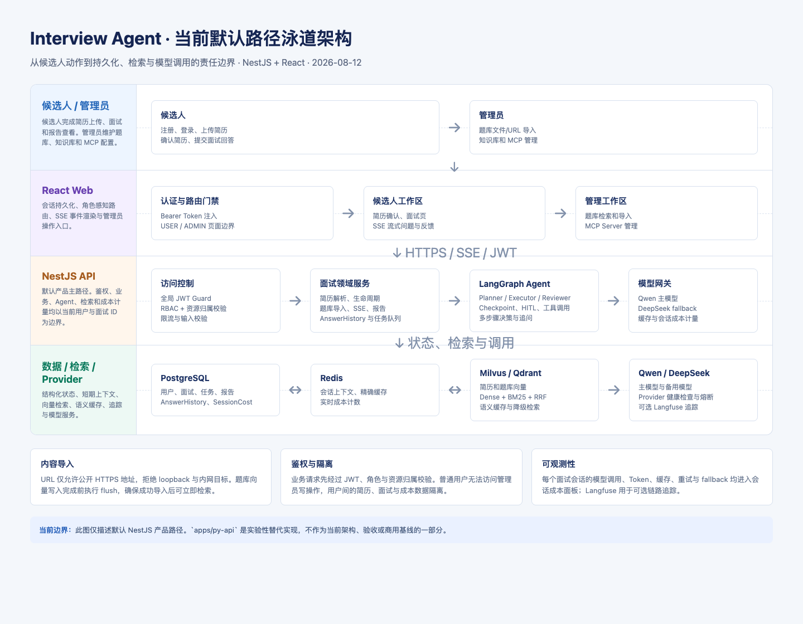
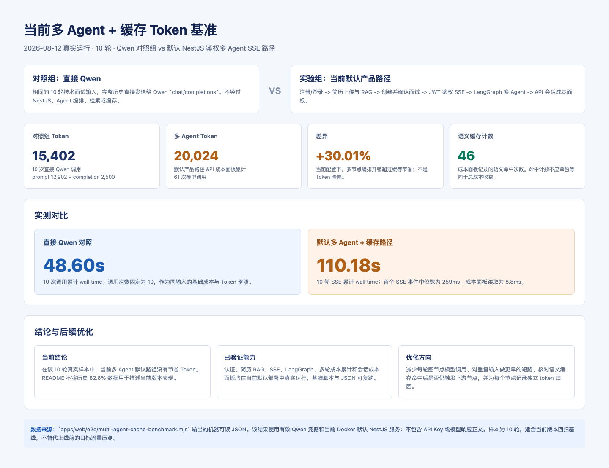
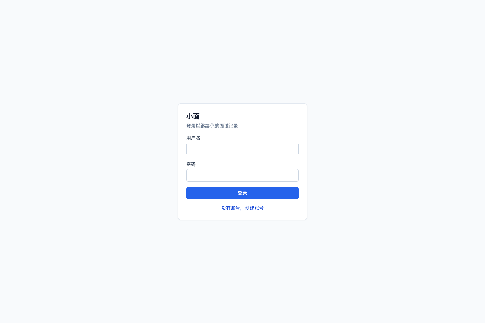
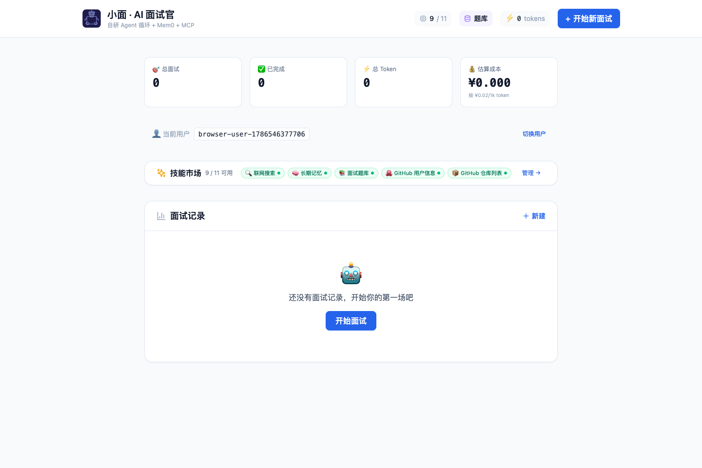
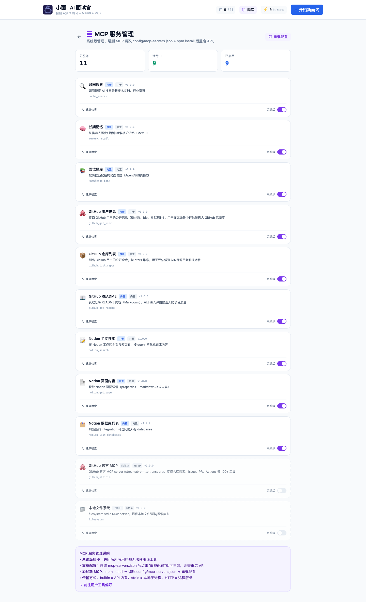
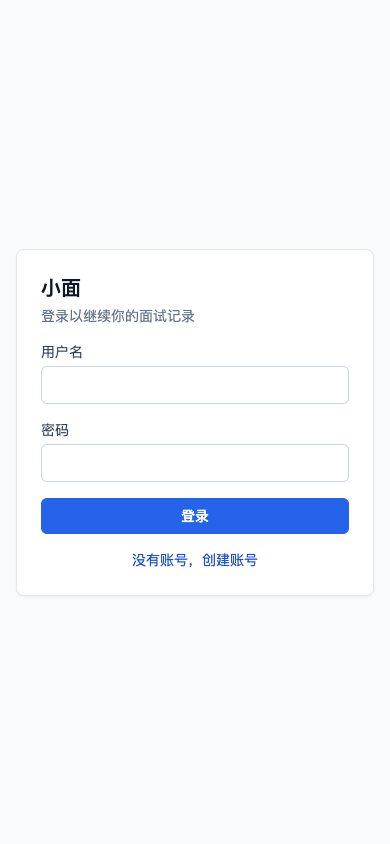
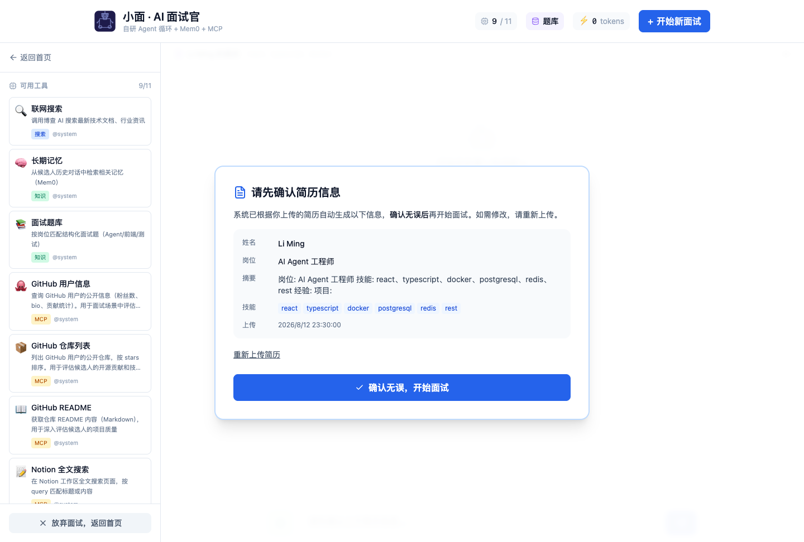
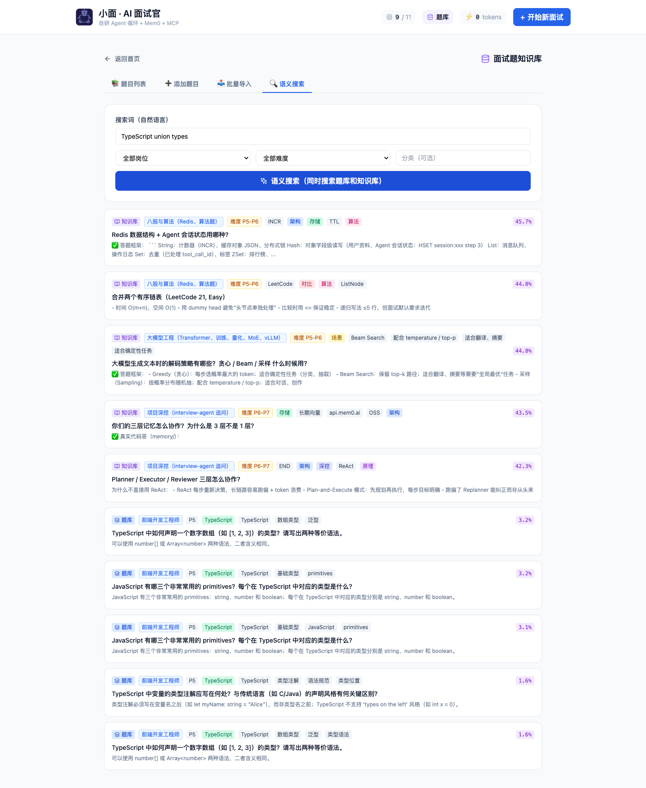

# Interview Agent

面向技术招聘场景的开源 AI 面试平台。候选人上传简历后，系统会解析候选人信息、生成岗位相关题目，并通过流式对话完成追问、评估与报告；管理员可以维护题库，并从文件或公开技术文档导入内容。

项目默认采用 NestJS + React 技术路线，面向企业内部验证和受控上线设计。系统将模型编排、检索、持久化状态、权限控制、可观测性和验收测试组合为完整的面试业务闭环。

## 核心能力

- **简历工作流**：支持 `PDF`、`Markdown`、`TXT` 简历，提取结构化候选人信息，写入检索上下文，并生成个性化追问题。
- **面试工作流**：支持创建面试、确认简历、SSE 流式对话、动态出题、人工审批（HITL）和报告生成。
- **模型网关**：Qwen 作为主模型、DeepSeek 作为备用模型，具备健康检查、永久错误熔断、自动降级、语义缓存和会话成本统计。
- **RAG 与题库**：结合 Milvus dense retrieval、BM25 sparse retrieval、RRF 融合和 rerank；管理员可从 Markdown 文件或公开 HTTPS 技术页面导入题目。
- **Agent 编排**：基于 LangGraph 提供状态图、checkpoint、持久化任务队列、答题历史与多角色 handoff。
- **安全控制**：使用 `scrypt` 密码哈希、默认拒绝的 JWT 鉴权、`USER`/`ADMIN` RBAC 和资源归属校验。
- **交付与验证**：提供 Docker Compose、健康检查、Prisma migration、API/Web 测试、浏览器验收和真实模型内容工作流验收。

## AgentLab 迁移状态

本项目正在从 AI 面试应用逐步演化为 AgentLab。Interview Agent 是 AgentLab 的第一个真实应用，而不是平台边界。

当前已完成 Phase 1、Phase 2 与 Phase 3 的基础能力：

- 以 NestJS `apps/api` 作为唯一主线。
- 新增默认 Workspace、Agent、AgentVersion 的领域模型和数据库迁移。
- 提供 Agent Registry：创建、查看、编辑、删除、克隆 Agent；创建、发布和回滚 AgentVersion。
- 通过 `POST /api/agent-lab/bootstrap/interview-agent` 幂等注册当前 `Interview Agent v1.0.0`。
- 新增 `Application` 与 `ApplicationRun`：`POST /api/agent-lab/applications/bootstrap/interview` 幂等注册 Interview Application。每轮既有 Interview SSE 在不改变 RAG、记忆、任务队列和流式响应的前提下，旁路创建和完成对应的 Lab Run，并通过 `externalRunId` / `externalSessionId` 关联原始面试。
- 提供独立运行接口 `POST /api/agent-lab/agents/:agentId/run`，并持久化 Run 与有序 TraceEvent。
- 提供 Run 列表、详情和 Trace 查询接口。首个适配器复用现有 `MultiAgentService`，不改变 Interview 控制器。
- TraceEvent 采用追加式事件契约：包含 `formatVersion`、单调 `seq`、`turnId`、`step`、`callId`、JSON-safe payload 与模型可见标记。支持 `turn.start/end`、`user.message`、`assistant.message`、`tool.call/result`、审批与失败事件。
- 提供版本化 `EvaluationDataset`、`EvaluationCase`、`Evaluator`、`EvaluationRun` 和 `EvaluationResult`。评测结果关联实际 Agent Run，按 AgentVersion 与 Dataset 版本可回溯。
- 首版评测器为确定性规则：`KEYWORD` 检查输出关键词、`JSON_SCHEMA` 检查输出字段、`LATENCY` 检查运行耗时。每条结果保存分数、阈值、断言明细、输出摘要和失败原因。

评测 API 位于 `/api/agent-lab`：创建 Dataset 与 Case、创建 Evaluator 后，可调用 `POST /agents/:agentId/evaluations` 同步执行已发布版本；`GET /agents/:agentId/evaluations` 查看汇总，`GET /evaluations/:evaluationId` 查看逐用例结果。输入用例必须满足目标 Agent 的输入契约，首个 Interview 适配器要求 `input.message` 非空。

当前阶段不会替换既有 Interview 接口和 LangGraph 面试流程。Run 已记录状态、输入、输出、耗时和错误；Token 与成本仍依赖现有 Interview 会话统计，独立 Run 会明确标记该指标暂不可用。评测不以不稳定的 LLM Judge 作为基础契约，尚未导入现有 Golden Dataset JSON。部署前必须运行 `pnpm db:deploy`。

Docker API 启动时只执行 `prisma migrate deploy`，迁移失败会阻止服务接收流量，不再使用 `db push --accept-data-loss` 或吞掉 schema 错误。`20260817110000_add_interview_workflow_persistence` 为历史上由 `db push` 创建的面试任务、答题历史、反思日志与简历确认字段补齐版本化契约，对已存在对象保持幂等。升级已有开发库前应先比对当前 schema，再使用 `prisma migrate resolve --applied` 登记已验证存在的历史 migration；不要以删除业务表的方式强行对齐。

Web 端新增 `/lab` 工作台，包含概览、Application、Agent、Run/Trace 和离线评测视图；Trace 的 JSONL 导出仍使用受 JWT 保护的 API 请求。数据集可从页面创建并录入 Interview 输入用例，评测器仅支持 `KEYWORD`、`JSON_SCHEMA`、`LATENCY` 三种确定性规则。当前工作台不提供版本编辑器、批量导入或 LLM Judge，这些能力不能被视为已交付。

Trace 查询继续使用 `GET /api/agent-lab/runs/:runId/trace`，并新增 `GET /api/agent-lab/runs/:runId/trace.jsonl` 供离线回放。运行时只追加事件，不会原地覆盖历史；模型历史只从 `user.message`、`assistant.message`、`tool.result` 事件投影，标准模型可见事件不能被静默标记为不可见。当前保留策略遵循数据库生命周期，尚未提供归档或脱敏清理任务；大 payload 仍存于 PostgreSQL JSON 字段，尚未接入对象存储引用。

AgentLab 新增独立 `ToolRunner` 契约，供后续 MCP、插件和工作区 provider 接入：每次调用均写入 `tool.call`，依次经过只读 hook、只可拒绝的 guard、强制审批和 provider，最终无论成功、拒绝、取消、超时或异常均写入唯一 `tool.result`。审批默认拒绝，缺少处理器、超时或处理异常不会放行；审批请求和决定持久化到 `ToolApproval` 并通过 `callId` 关联。

首版本地执行能力只提供 `plan`（只读）和 `workspace-write`（受控工作区写入）预设，使用最小环境变量、受控临时目录、相对路径与符号链接边界检查、超时和输出大小上限。它不是 OS 级沙箱，网络放行默认拒绝，本地部署不应将其用于不受信任的任意命令；生产环境应改用受限容器或远程 worker。现有 Interview/MCP 调用尚未迁移到该管道，以避免改变已有业务流程。

可观测性与扩展前置能力：`GET /api/agent-lab/runs/:runId/trace.bundle` 导出带运行元数据、按序事件和大 payload 引用的本地 Trace bundle，可由离线 reducer 还原模型会话、工具调用/结果、终态与错误关联。生命周期遥测尽力写入，不会因为遥测异常中断 Agent Run；模型可见历史和 ToolRunner 安全审计仍为强制事件。插件使用版本化 manifest 与 capability provider，可卸载/重载且不会遗留注册；MCP 仅作为 provider，必须由调用方交给 ToolRunner 后才会执行。

子 Agent 或后台任务必须创建独立的子 Run，保存 `parentRunId`、独立 `budget`、状态和取消时间，并通过父子 Trace 事件投递创建、结果、取消或失败。`budget.maxToolCalls` 由 ToolRunner 基于已追加的 `tool.call` 事件强制执行，父 Run 和子 Run 均适用。当前仅提供状态与审计契约，不包含队列调度器、远程 worker 或自动重试；这些能力将在真实隔离执行环境完成后接入。新的迁移尚未在数据库应用，部署前必须执行 `pnpm db:deploy`。

## 系统架构



架构图采用泳道形式，按“候选人/管理员 -> React Web -> NestJS API -> 数据、检索与 Provider”展示责任边界。它仅描述当前默认 NestJS 产品路径，不包含已废弃或未对齐的历史实现。

### 面试请求链路

```text
候选人提交回答
  -> Bearer JWT、角色与资源归属校验
  -> 读取面试状态、简历上下文和题库检索结果
  -> LangGraph 编排追问、评分和工具调用
  -> 精确/语义缓存与 Provider 路由、降级
  -> SSE 流式事件返回浏览器
  -> 持久化 AnswerHistory、任务、报告、成本和追踪信息
```

## 核心工程优势

### 持久化、可审查的 Agent 执行

面试流程不是无状态 Prompt 拼接。LangGraph 协调 planner、executor、reviewer 和 specialist handoff；checkpoint 使长流程可检查、可恢复。持久化任务队列和 `AnswerHistory` 保存候选人的真实回答与评分信号，报告生成从这些结构化记录读取数据，而不是根据聊天顺序猜测问答角色。

### 兼顾召回与写后可见性的检索设计

题库检索组合 dense vector search、BM25 sparse search、RRF 融合和 rerank。简历按用户独立写入检索上下文。题库导入完成前会显式 flush 向量写入，因此成功响应意味着数据可立即检索，避免向量索引异步物化带来的“写入成功但搜索不到”问题。

### 多模型容错与成本可见性

模型网关优先调用 Qwen，必要时切换到 DeepSeek。Provider 健康检查会区分永久性凭据/账单错误与临时错误；永久错误会被熔断，避免无效重复请求。精确缓存和语义缓存用于减少重复调用，会话级 token 与成本记录用于后续运营分析。

### 多 Agent 与缓存 Token 基准



这是 2026-08-12 基于当前默认 NestJS 路径完成的真实对照：同一组 10 轮技术面试输入，一组直接调用 Qwen，另一组完整经过注册登录、简历 RAG、面试确认、JWT 鉴权 SSE、LangGraph 多 Agent 和会话成本面板。

| 指标 | 对照/口径 | 多 Agent + 缓存结果 |
| --- | --- | --- |
| Token 消耗 | 直接 Qwen：`15,402` tokens | 当前多 Agent 路径：`20,024` tokens |
| Token 差异 | 相同 10 轮输入 | `+30.01%`，当前未实现总 Token 节省 |
| 模型调用 | 对照组 `10` 次 | 多 Agent 路径 `61` 次 |
| 语义缓存计数 | 当前会话成本面板 | `46` 次命中记录 |
| 累计 wall time | 直接 Qwen `48.60s` | 多 Agent SSE `110.18s` |
| SSE 首事件中位数 | 当前多 Agent SSE | `259ms` |
| 成本面板响应 | 当前运行中 API | `8.8ms` |

实测说明：当前多节点图编排的调用开销大于缓存带来的收益，因此不能将语义缓存命中次数直接解释为 Token 节省。该结果作为当前版本的回归基线，后续优化方向是减少每轮图节点调用、对重复输入提前短路、确认缓存命中后不再触发下游模型节点，并增加按节点的 Token 归因。

完整机器可读结果见 [当前多 Agent 基准 JSON](apps/web/e2e/screenshots/acceptance-2026-08-12/benchmarks/multi-agent-cache-2026-08-12T16-50-35-272Z.json)，可通过 `node apps/web/e2e/multi-agent-cache-benchmark.mjs` 复跑。该脚本使用有效 Provider 凭据，输出只包含脱敏聚合指标，不记录 API Key 或模型正文。

本轮基准还修复了会话成本统计的累计问题：同一面试的后续消息不再重置 Redis 实时计数器，并已加入对应的回归测试。

### 贯穿产品的安全边界

安全不只存在于登录接口。全局 JWT Guard、角色 Guard 和资源归属校验共同保护业务接口；前端会隐藏管理员操作并将普通用户从管理路由重定向，后端仍是最终授权边界。题库写入、知识库写入和 MCP 管理仅允许管理员执行。

### 显式失败语义的内容导入

简历上传有明确的文件格式约束。题库 URL 导入仅允许公开 HTTPS 地址，拒绝内网和 loopback 地址，保留页面标题，并能从技术文档生成面试题，而非只能提取已有问答。如果页面无法产出可用题目，接口返回明确错误，而不是返回空数据的伪成功。

## 技术栈

| 领域 | 技术 |
| --- | --- |
| 前端 | React 18、Vite、TypeScript、Zustand、TanStack Query |
| 后端 | NestJS 10、TypeScript、Prisma |
| Agent | LangGraph、DeepAgents、Model Context Protocol |
| 模型 | Qwen OpenAI 兼容 API、DeepSeek fallback |
| 数据 | PostgreSQL、Redis、Milvus、Qdrant |
| 可观测性 | Langfuse、会话级 token 与成本统计 |
| 质量保障 | Docker Compose、GitHub Actions、Jest、Vitest、Playwright |

## 快速开始

### 前置要求

- Node.js 20+
- pnpm 9+
- Docker Desktop / Docker Compose
- Qwen API Key，用于简历解析、embedding、出题和流式面试

### 配置并启动

```bash
cp .env.example .env
```

至少需要配置 `QWEN_API_KEY`，且应在任何非本地部署中替换 `JWT_SECRET`。`DEEPSEEK_API_KEY` 可选，但配置后可启用 Provider 降级。需要初始化管理员时，请在管理员注册前通过 `ADMIN_USER_IDS` 配置受控的用户 ID 列表。

```bash
pnpm install
pnpm docker:up
pnpm db:deploy
```

| 服务 | 地址 |
| --- | --- |
| Web 应用 | http://localhost:5173 |
| API | http://localhost:3001/api |
| Liveness | http://localhost:3001/api/health |
| Readiness | http://localhost:3001/api/health/ready |

默认产品路径为 NestJS API。`apps/py-api` 保留为实验性、按需启用的实现，不是当前推荐的产品部署路径。

### 注册与登录

```bash
curl -X POST http://localhost:3001/api/auth/register \
  -H "Content-Type: application/json" \
  -d '{"userId":"local-user","password":"local-password-123"}'

curl -X POST http://localhost:3001/api/auth/login \
  -H "Content-Type: application/json" \
  -d '{"userId":"local-user","password":"local-password-123"}'
```

登录响应会返回 `accessToken`、`tokenType`、`expiresIn`、`userId` 和 `role`。访问受保护的接口时携带：

```text
Authorization: Bearer <accessToken>
```

## 主要业务流程

### 候选人流程

1. 注册或登录。
2. 通过 `POST /api/interview/upload-resume` 上传简历，multipart 字段名为 `file`，并传入 `position`。
3. 查看解析后的简历和个性化问题。
4. 调用 `POST /api/interview/start` 创建面试。
5. 确认简历后，通过 `POST /api/interview/:interviewId/message` 进行流式对话。
6. 结束面试并生成报告。

候选人的面试和简历数据均绑定当前登录用户，其他用户访问会被拒绝。

### 管理员流程

- 通过 `POST /api/interview/question-bank/import-file` 导入题库文件。
- 通过 `POST /api/interview/question-bank/import-url` 从公开技术文档导入题目。
- 检索和管理题库。
- 导入、管理和基准测试共享知识库。
- 查看、重新加载和启停已配置 MCP Server。

## 测试与验收链路

质量门禁按“静态检查 -> 回归测试 -> 生产构建 -> Docker 健康检查 -> 浏览器验收 -> 真实 Provider 内容工作流 -> 截图与 JSON 证据”推进。当前验证数据见上方的“当前质量门禁与验收证据”图；缓存命中数据受 Provider 能力影响，不能脱离特定模型和负载单独解读。

| 验证层级 | 覆盖内容 |
| --- | --- |
| API 回归测试 | 注册登录、角色授予、跨用户资源隔离、简历输入校验、导入失败语义和核心服务逻辑 |
| Web 单元测试 | 组件行为、前端状态和权限相关展示 |
| Typecheck 与生产构建 | 跨模块类型契约、Prisma 类型和可部署产物 |
| API CI 接口校验 | 在已构建服务中验证健康检查、认证和关键接口行为 |
| 浏览器验收 | 对 Docker 中运行的真实前后端验证登录门禁、管理员路由和移动端渲染 |
| 真实 Provider 内容工作流 | 验证简历解析、RAG 写入、个性化出题、面试确认、文件/URL 导入、即时检索与 SSRF 拒绝 |

### 最近一次验收证据

2026-08-12 的交付验收重新构建了 Docker API 与 Web 镜像，结果如下：

| 检查项 | 结果 |
| --- | --- |
| API Jest | `214 passed` |
| Web Vitest | `59 passed` |
| API 与 Web typecheck/build | 通过 |
| Prisma schema validation | 通过 |
| 浏览器认证与 RBAC 验收 | `9/9 passed` |
| 有效 Provider 的真实内容工作流 | `10/10 passed` |

内容工作流验证了简历上传与 RAG 写入、个性化问题生成、面试创建与确认、题库文件导入、从技术文档 URL 生成题目并立即检索、用户数据隔离和 SSRF 拒绝。

可查看完整的[验收报告](docs/ACCEPTANCE-REPORT-2026-08-12.md)、[内容工作流 JSON 结果](apps/web/e2e/screenshots/acceptance-2026-08-12/content-workflow-results.json)和[浏览器验收 JSON 结果](apps/web/e2e/screenshots/acceptance-2026-08-12/real-results.json)。验收脚本会将截图和 JSON 结果提交到仓库，便于评审者在不先复跑真实 Provider 链路的情况下检查证据。

### 浏览器验收截图

| 登录门禁 | 普通用户首页 |
| --- | --- |
|  |  |

| 管理员 MCP 管理页 | 移动端登录门禁 |
| --- | --- |
|  |  |

| 简历确认与开始面试 | URL 题库导入后的检索 |
| --- | --- |
|  |  |

### 本地验证命令

```bash
pnpm typecheck
pnpm build
pnpm --filter @interview-agent/api test
pnpm --filter @interview-agent/web test
```

运行浏览器和真实内容验收前，需要先启动 Docker 环境、配置管理员账号和有效模型凭据：

```bash
node apps/web/e2e/content-workflow-acceptance.mjs
node apps/web/e2e/content-real-screenshots.mjs
```

## 开发与数据库

```bash
pnpm dev
pnpm dev:api
pnpm dev:web

pnpm db:generate
pnpm db:migrate
pnpm db:deploy
pnpm db:studio
```

生产发布应由部署流水线在新 API 版本接收流量前执行 `pnpm db:deploy`。

## 项目结构

```text
apps/
  api/                 NestJS API 与 Prisma schema
    src/agents/        LangGraph 编排与 Agent 工具
    src/modules/       auth、interview、llm、memory、knowledge-base、mcp
    prisma/            数据库 schema 与 migration
  web/                 React 应用与浏览器验收脚本
  py-api/              实验性替代后端，默认不启用
packages/
  shared-types/        前后端共享类型
docs/
  ACCEPTANCE-REPORT-2026-08-12.md
```

## 已知边界与后续商用工作

- 尚未提供 refresh token rotation、token revocation list、邮箱验证、OAuth/SSO、MFA 和审计导出。
- Provider fallback 已实现，但临时 Provider 错误尚未提供请求级指数退避。
- 语义缓存和 prompt cache 的实际收益依赖具体模型与真实流量，应在目标业务中单独压测后再形成成本结论。
- Langfuse 与 Mem0 是可选集成；将候选人数据发送到第三方服务前，需要独立进行隐私与合规评估。
- 当前 Milvus 为单机 Compose 部署；多租户、高数据量场景需要容量规划、备份方案和托管或集群化向量数据库。
- SSE 断线重连尚无服务端 event offset，无法恢复已部分传输的流式响应。
- `apps/py-api` 与默认 NestJS 产品路径暂未保持功能完全一致。

## License

MIT © 2026
