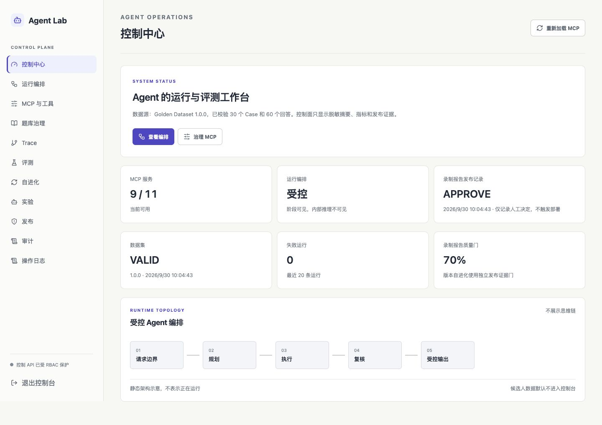
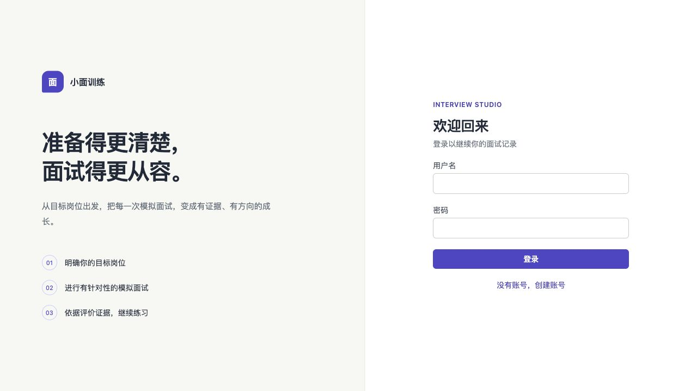

# 双端工作台设计与完整交付清单

日期：2026-10-08；阶段：`DELIVERY-UI-REFRESH-1`；分支：`agent-lab`。

状态：本阶段 UI 工程与本机验收通过。完整项目尚未通过全部业务与生产门禁。

## 完成内容

- Interview：暖灰画布、靛蓝主色、浅色侧栏、工作台顶栏与品牌层级；登录双栏介绍/表单，移动端简化；底部导航适配安全区。
- Agent Lab：白色面板、统一表单/按钮/状态、保留数据密度与真实空态；手机保留退出入口与 16px 输入字号。
- 浏览器发现两处 Grid 最小宽度问题：横向导航和控制中心架构示意撑宽手机页。已用零最小轨道与 grid item min-width 修复；图示在自身区域滚动，整页不溢出。
- 录制报告历史决定与质量门明确标注；版本自进化仍使用独立 v4，真实对比 REJECT 时管理员发布禁用。
- 完整交付顺序与未验证范围已保存于 `docs/product/COMPLETE_DELIVERY_PLAN.md`。

## 验证证据

| 检查 | 结果 |
| --- | --- |
| Web Vitest | 15 files / 83 tests passed |
| 全工作区 typecheck / lint / build | 通过；lint 0 errors、4 条既有 warnings |
| 最终前端 Docker build | Web、Agent Lab 成功，本机容器已更新 |
| 暂存源码独立验证 | 排除原有未提交编辑后，Web 83 tests 与 Web/Lab build 再次通过；复用已安装依赖，未宣称全新环境安装验收 |
| 桌面布局 | Interview 1280px 的首页/记录/训练/设置；Lab 1440px 的 11 导航页无整页横向溢出 |
| 手机布局 | 390px 的 Interview 4 导航页和 Lab 11 导航页无整页横向溢出 |
| 汇总布局断言 | 30/30，通过实际 DOM 宽度核验 |
| 登录与状态 | 既有本地合成管理员账号登录 Interview 成功；训练无岗位时显示真实缺失说明；Lab 比较显示 v4 REJECT，发布禁用 |
| 退出与可访问性 | Lab 手机退出按钮可见；保留标签、导航语义、可见焦点、禁用状态和减少动态样式 |

截图为合成验收控制面的无凭据视图：

## 影响与限制

代码文件：Interview App/AppShell/index.css/Tailwind 配色；Lab main.tsx 的主题导入与控制中心标签、visual-theme.css；相关产品规格与交接文档。

复用 React/Tailwind/Lucide，无新依赖或架构迁移；无数据库/API/鉴权/额度/模型合同变化，未新增付费 Provider 调用。UI 保留候选人与管理员边界，本轮未全面重跑后端安全或真实面试质量 Benchmark；此前 API 545 测试证据属于上一轮，不冒充本轮执行。

本机镜像继续包含既有未提交 UI/题库/认证编辑；本阶段提交只包含本轮设计改动。它们需要独立核验整合后才能交付干净生产版本。浏览器布局核验不等于所有真实业务闭环或无障碍认证；报告/面试房间真实模型流程和公开生产环境本轮未验收。

## 后续

下一阶段修复普通 Interview 答案缓存的完整上下文/策略/模型隔离；随后核对组织额度与中断费用，在明确新预算后完成可信评测，再核验完整训练闭环与可复现部署。候选未发布，原真实评测失败不能记为交付。
