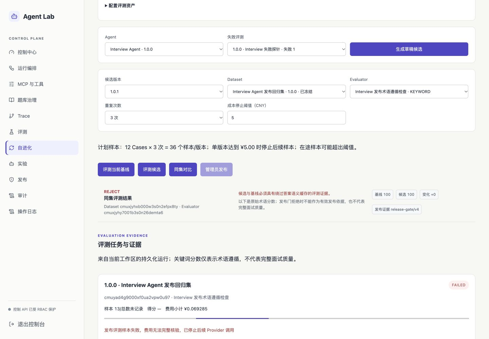

# 交付核验报告

**Interview Agent / Agent Lab · 2026-10-08 · DELIVERY-CLOSEOUT-1**

本版完成评测任务可靠性、认证与题库治理、依赖兼容升级、可信 CI 和文档整理，并通过本地全量工程、数据库、真实 Milvus/Qdrant 隔离恢复和浏览器验收。代码位于 `agent-lab`，通过 PR #4 合入 `main` 前仍需最新远端 CI 全绿。本报告不把本地部署称为生产发布，不把合成或录制指标称为真实模型效果。

## 交付内容

| 主题 | 实际改变 | 影响 |
| --- | --- | --- |
| 评测任务 | PostgreSQL 持久化、202 回执、requestKey 幂等、原子领取、心跳与进度 | 加性迁移；过期任务失败且不自动付费重放。软预算最多存在一个在途样本超额 |
| 评测证据 | 同 Dataset / Evaluator 对比、选择变化清除旧结论、失败与未知成本展示 | 历史缓存污染结果不能通过 v4 发布门；关键词分数不等于综合质量 |
| 认证 | 两端统一当前 401 恢复，迟到旧请求不删除新会话，Lab 清除旧查询缓存 | 不改变后端 JWT / RBAC / 租户归属授权边界 |
| 题库治理 | ADMIN 列表与检索、真实删除结果、搜索竞态处理、来源缺失与错误态 | 删除失败返回明确错误；未新增模型题库写入验收 |
| 依赖 | 固定 pnpm、冻结锁文件、官方 registry、NestJS 11 / Router 7 / Multer 2 / uuid 兼容升级与 braces 补丁 | 唯一剩余官方 high 为无上游修复的 braces advisory；补丁缓解不等于上游修复或独立审计 |
| 交付呈现 | 暖灰/白/靛蓝界面，标注合成与录制来源，README 与当前上下文精简 | 不填充虚构用户、增长、质量或费用指标；历史上下文保留归档 |
| CI | 严格 lint、真实 Redis、PostgreSQL 新库/升级、测试和三端镜像；API 真实 Milvus 写入、Qdrant/Milvus 恢复读回 | 移除失败后继续的 lint 行为；最新 Actions 仍须核对。未添加“审计零漏洞”声明 |

专题证据：[评测任务](ACCEPTANCE-REPORT-2026-10-08-EVALUATION-JOBS.md)、[认证与题库](ACCEPTANCE-REPORT-2026-10-08-AUTH-GOVERNANCE.md)、[缓存](ACCEPTANCE-REPORT-2026-10-08-ANSWER-CACHE.md)。设计复用既有 React / NestJS / Prisma / LangGraph；没有引入新队列、数据库或付费供应商。

## 验证结果

以下均为本轮实际执行结果，不代表覆盖率。

默认 Jest 仍显式排除 5 份旧设计 spec，本轮未恢复，详见 [TESTING.md](TESTING.md)。数据库 17 项是单独执行通过的条件集成测试，不将“默认跳过”当作成功。

| 检查 | 结果 | 口径 |
| --- | --- | --- |
| API Jest | 87 suites / 663 tests 通过 | 4 suites / 20 tests 明确 skip；另有 3 suites / 18 tests 由专用数据库步骤执行 |
| PostgreSQL 专用回归 | 3 suites / 18 tests 通过 | 新库、保留旧业务记录的升级、租户、原子额度与任务竞争 |
| 缓存单元 | 22 通过 | 确定性 fixture |
| Web / Lab 组件 | 18 files / 99 tests 通过 | 包括会话竞态、题库与评测状态 |
| 严格 lint | 0 error / 0 warning | 不以跳过或吞掉退出码替代成功 |
| 类型 / 三端生产构建 | 通过 | Prisma Client 生成后校验 |
| 三端 Docker | 构建通过、本地运行正常 | API 与 migration 共用镜像；锁文件与本地补丁进入镜像 |
| 实际 API 镜像 smoke | 28/28 通过 | 独立 PG/Redis/Milvus、internal Docker 网络；含会话撤销、训练并发幂等、真实 Milvus 写入及准确主键补偿；无模型执行 |
| 真实 API 浏览器 | 24/24 通过 | 合成账号，登录、岗位 CRUD/版本、资源隔离、过期会话、ADMIN 与 390px 布局 |
| Lab 浏览器 | 通过 | ADMIN / USER 门禁、题库入口、MCP 与录制 fixture 导入/实验/决定记录 |
| 报告浏览器 | 8/8 通过 | 桌面/手机合成报告、证据回放与训练入口；API 响应为 fixture |
| Golden Dataset | 30 Cases 格式通过 | 合成基准，不证明真实业务质量 |
| braces 安全回归 | 6/6 通过，已计入 API | 实际 DeepAgents → micromatch / fast-glob 链；深层字符串拒绝与正常模式兼容 |
| multipart HTTP 回归 | 3/3 通过，已计入 API | 实际 NestJS + 新 Multer；合法上传、超限 413、畸形 400；不调用模型 |
| 数据库与向量恢复 | 通过 | PostgreSQL 逻辑转储恢复后 schema/数据/序列规范化转储一致；停止写入后配对复制 Milvus+etcd 与 Qdrant，重建后通过 API 读回合成记录和向量载荷 |

恢复演练只使用临时隔离容器和合成数据，脚本在退出时清理副本；没有读取或提交生产用户数据。该演练验证 PostgreSQL、Milvus+etcd 与 Qdrant 的本地恢复路径，不证明异地灾备、生产 RTO/RPO 或容量目标。

可复跑命令见 README。浏览器脚本输出按实际执行日期分目录；运行截图和原始日志默认不提交。只将脱敏聚合结果记录为交付证据。

## 数据真实性与 AI 验收

| 数据 | 当前事实 | 不可推出的结论 |
| --- | --- | --- |
| Golden Dataset | 30 个合成工程 Case | 生产用户表现、真实模型质量 |
| 发布 Dataset | 12 个已审查冻结的合成业务场景 | 代表全部岗位或真实候选人分布 |
| 首轮基线 / 候选 | 36+36 样本受答案缓存污染，证据无效 | 100 分、零费用不能支持候选提升 |
| 隔离基线 | FAILED，13/36 成功样本；已核验小计 ¥0.069285，中断费用未知 | 不能称为完成评测或完整账单 |
| 当前发布门 | `release-gate/v4`，REJECT / RG-021 | 不能放宽门禁或自动发布 |
| 版本 | 正式 1.0.0；候选 1.0.1 DRAFT | 没有已验收的自进化收益 |
| 录制报告 APPROVE | 工程 fixture 的人工决定记录 | 不触发部署或真实 Agent 版本发布 |

冻结发布集指纹为 `sha256:2b7afcec3f242506a3f12915630121fe5795903f18382ef842cae31be6bfc39a`。本轮没有新增付费业务 Benchmark；API 重启有正常 Provider 健康探测，不能声明完全零模型调用。真实对比续跑前需核验月度额度与中断费用，确定新的有界预算。详情见[真实业务评测报告](ACCEPTANCE-REPORT-2026-10-07-CURATED-REAL-EVALUATION.md)。

## 依赖安全

使用官方 npm registry 执行 `pnpm audit --prod --json`。审计统计按公告计数，并非独立包数。

| 审计 | critical | high | moderate | low |
| --- | ---: | ---: | ---: | ---: |
| 升级前 | 1 | 26 | 44 | 5 |
| 升级后 | 0 | 1 | 0 | 0 |

Multer、MCP SDK、proxy-addr、axios、grpc、protobufjs、hono 等采用兼容修复版本，并冻结解析结果。NestJS、React Router、uuid 已完成兼容迁移。braces 没有上游已修复版本，保留 3.0.3 并通过 pnpm patch 限制字符串解析嵌套深度 32；官方版本审计仍报告 high，不能当作上游修复或审计通过。[braces 公告](https://github.com/advisories/GHSA-vfj7-8cjw-p6xm)

补丁位于 `patches/braces@3.0.3.patch`，锁文件 patch hash 为 `xnz46gr5zjrzqvkrjzopcyhulq`。已核验 parse / compile / expand / stringify、手工构造 AST 的循环/宽度/节点数与 parent 链，以及 fast-glob 正常模式；最大嵌套深度 32，超深模式会被拒绝。依赖升级必须重新审核补丁与回归，不能静默移除。

| 剩余依赖 | 公告 | 后续处理 |
| --- | --- | --- |
| braces 3.0.3 | GHSA-vfj7-8cjw-p6xm，high | 本地补丁与 SDK 可达路径有回归，持续跟踪上游；官方 audit 仍报告 high |

仍有一个 high，因此不能宣称达到零高危商业发布基线。CI 的工程绿灯不能替代风险复核；main 合并状态和远端检查记录在[当前状态](project/CURRENT_STATE.md)。

## 未完成与建议

1. 跟踪 braces 上游修复；出现修复版本后移除本地补丁并重新执行安全回归。
2. 核验额度和未知费用后，经新的有界预算执行真实同集对比；人工审查通过后才能发布候选。
3. 生产环境完成 TLS、凭据/网络隔离、向量库与异地备份、容量与故障演练。
4. 完成训练 → 再面试 → 可比证据的闭环验收；当前页面与 fixture 不证明训练提升。
5. 后续独立处理服务端退出吊销、题库输入/批量成本合同、评测取消与精确结算、旧缓存保留策略。

本版是经本机验证的工程交付候选。商业生产发布、完整模型质量结论和上述未完成事项保留为明确待办，不以文案或虚构数据填补。

脱敏机器可读结果：[release-readiness-2026-10-08.json](assets/release-readiness-2026-10-08.json)。

