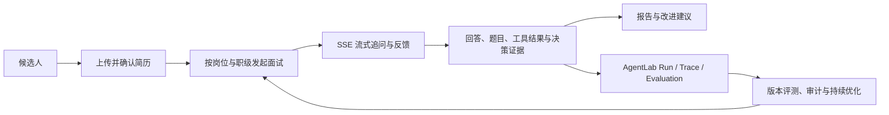
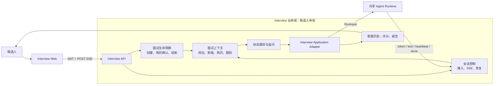
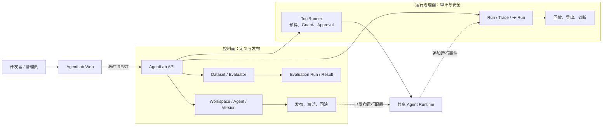
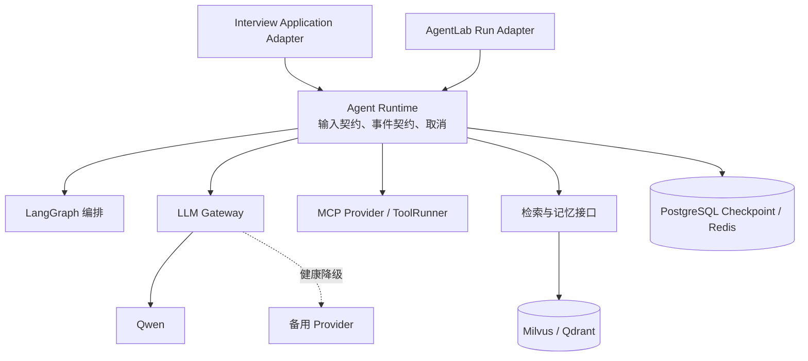

# Interview Agent 产品目标宪法

> 状态：Active
>
> 适用范围：Interview Agent 产品主线与 AgentLab 平台演进
> 最后更新：2026-08-20

## 1. 产品使命

Interview Agent 是面向技术岗位候选人的 AI 模拟面试产品。用户完成简历确认后，应获得与目标岗位、职级和自身经历一致的多轮面试、可解释的反馈，以及可回溯的成长报告。

AgentLab 是产品的能力平台，不是脱离业务的独立演示台。Interview Agent 是它的第一个真实应用：平台能力必须先改善面试的可控性、可评测性、安全性或可观测性，再扩展到更多应用。

## 2. 产品闭环

产品不得把模型输出、工具调用或 Trace 本身当作用户价值。用户价值是“基于真实岗位约束得到可信、连续、可解释的面试体验”。

## 3. 双架构与职责边界

系统包含两个产品架构，复用同一套运行时与基础设施：

- **Interview**：面向候选人的业务应用，目标是完成可靠、有针对性的模拟面试闭环。
- **AgentLab**：面向开发者和运营者的平台，目标是管理 Agent、验证版本、审计运行和控制工具执行。

它们不是两个独立后端，也不是互相调用的“上下游产品”。Interview 通过明确的 Application Adapter 使用共享运行时；AgentLab 通过只追加的运行记录观察和治理该运行时。

### 3.1 Interview 业务架构

**Interview 的唯一责任**：候选人、简历、目标岗位、面试状态、题目、回答、评分、报告与 SSE 交互。它拥有这些业务数据的最终写入权。

Interview 不负责管理 Agent 版本、维护评测集、安排后台执行器，或直接操作平台的 Trace/审批表。

### 3.2 AgentLab 平台架构

**AgentLab 的唯一责任**：Agent 定义和版本、评测、发布门禁、运行审计、工具预算与审批。它拥有平台对象和审计对象的最终写入权。

AgentLab 不拥有候选人业务状态，不生成面试报告，不决定面试题，也不直接向候选人浏览器输出 SSE。

### 3.3 共享运行时与基础设施

共享运行时只接受标准化输入并输出标准化事件；它不应知道“简历页面”“报告页面”或“评测工作台”。业务语义由 Application Adapter 注入，平台治理由 AgentLab Adapter 订阅。

### 3.4 所有权矩阵

| 能力 | 责任方 | 输入 | 输出 | 禁止跨界 |
| --- | --- | --- | --- | --- |
| 候选人面试 | Interview | 简历、岗位、职级、回答 | SSE、题目、报告 | AgentLab 不修改面试业务状态 |
| Agent 运行 | Shared Runtime | `RunInput`、运行配置 | 标准事件、终态 | 不直接操作业务页面或业务表 |
| Agent 版本与发布 | AgentLab | Agent 定义、版本、评测结果 | 已发布配置 | Interview 不直接编辑平台版本 |
| Trace 与审计 | AgentLab | 运行事件 | Run、Trace、回放包 | Trace 写入失败不能阻断面试 |
| 工具审批与预算 | AgentLab / ToolRunner | `tool.call`、策略、审批决定 | `tool.result` | 工具不得绕过审批直接执行 |
| 模型、缓存、存储 | Shared Infrastructure | 规范化请求 | 可用性、数据访问 | 不承载候选人业务流程判断 |

### 3.5 依赖规则

1. **候选人主链路优先**：AgentLab 的 Trace、遥测或评测失败不得阻断 Interview SSE、回答持久化或报告。
2. **单向审计**：Interview 通过 Adapter 产生运行事件，AgentLab 只追加记录和读取；平台不得反向篡改已完成的候选人面试。
3. **版本受控接入**：未来 Interview 只能使用 AgentLab 已发布且通过门禁的版本；当前固定面试运行时在完成等价验收前保持不变。
4. **数据单写**：Interview 表由 Interview 写入，AgentLab 表由 AgentLab 写入。跨域只传 ID、版本和显式事件，不跨域直接写表。
5. **运行时无业务耦合**：岗位、题目和简历由 Interview Adapter 组装后传入 Runtime，运行时不得猜测或硬编码前端、AI Agent 等岗位。

## 4. 不可破坏的产品规则

### 4.1 面试体验

- 一次用户发送对应一个独立请求生命周期。旧请求的超时、取消或结束事件不得影响后一轮。
- SSE 的 60 秒保护仅衡量成功建立 SSE 后的无事件时长。建连、鉴权和后端准备时间不计入。
- API 建连后立即发送心跳，并在长任务期间持续发送；前端心跳只维持连接，不写入对话或思考记录。
- 无论完成、错误、取消、断流或异常响应，前端都必须终结 streaming 状态并恢复输入与发送能力。
- `Enter` 用于多行回答，`Cmd/Ctrl + Enter` 用于发送；发送按钮始终提供可见的替代操作。
- 任何非关键侧栏、遥测或工具元数据异常不得使面试主页面崩溃。

### 4.2 面试质量

- 每轮只提出一个清晰问题；追问必须指向候选人上一轮回答的具体薄弱点。
- 出题、评分和报告必须带岗位、职级、题库与简历上下文；无上下文时应明确降级，不得编造个性化判断。
- 动态题目、评分记录和报告必须可关联到同一面试、题目版本及 Agent 版本。
- 生成报告应读取结构化答题历史，而非仅从聊天顺序猜测问答角色。

### 4.3 安全与数据边界

- 所有业务接口默认要求 JWT、角色校验和资源归属校验；前端隐藏不构成授权。
- ToolRunner 默认拒绝。工具调用必须经过可审计的 `tool.call` 与唯一 `tool.result`，审批缺失、超时或异常不能放行。
- 候选人数据发送给外部模型、记忆或可观测服务前，必须具备可配置开关和隐私评估；生产 Trace 需支持脱敏与保留策略。
- 数据库升级只使用版本化 Prisma migration；迁移失败时 API 不得接收流量。

### 4.4 可解释与可评测

- TraceEvent 采用追加式、顺序化契约，保留运行、轮次、步骤、调用与终态，不覆盖历史。
- AgentLab 评测优先采用确定性规则和版本化数据集；LLM Judge 只能作为补充信号，不能成为唯一质量契约。
- 关键决策应逐步沉淀为“决策 - 证据 - 结果”关系：例如追问、评分、HITL 审批和报告建议都可回溯其输入、规则与版本。

## 5. 当前阶段与演进边界

### 当前：产品 Beta + AgentLab Alpha

已具备面试闭环、简历/RAG、动态任务队列、LangGraph、多模型网关、HITL、报告、Docker 部署，以及 AgentLab 的 Agent/版本、Run/Trace、子 Run、确定性评测和 ToolRunner 契约。

当前不把以下能力宣称为已完成：远程隔离 Worker、队列调度与自动重试、SSE 事件 offset 续传、LLM Judge、可视化版本编辑、完整企业身份体系、多租户图谱或全量知识图基础设施。

### 下一阶段的优先级

1. **可靠性**：SSE event offset/续传、请求级 Provider 重试与恢复、面试状态机端到端回归。
2. **可解释性**：在 PostgreSQL 中落地轻量 `DecisionRecord` / `DecisionEvidence`，先服务评分依据与报告追溯。
3. **评测与发布**：Golden Dataset、批量导入、版本门禁与回归比较。
4. **受控执行**：将 Interview/MCP 调用逐步纳入 ToolRunner，并接入真正隔离的 Worker。
5. **企业化**：SSO/OAuth、令牌轮转、审计导出、数据保留/脱敏、备份与容量治理。

## 6. 架构决策准则

- 优先增强现有 NestJS、PostgreSQL、Redis、Milvus/Qdrant 与 LangGraph 主路径；新组件必须解决可量化问题。
- 不以“更多 Agent”“更多数据库”作为能力目标。新增编排或存储必须改善质量、延迟、成本、可解释性或安全性。
- 图谱、Ontology、复杂推理可作为未来的旁路决策与证据层 PoC；在真实跨实体检索需求成立前，不替换当前 RAG 和业务存储主链路。
- 每一项平台能力必须可被一个真实产品场景验证，且需有对应的可观测事件、测试和降级路径。

## 7. 修改本宪法

修改本宪法需要同时说明：

1. 改动解决的用户或业务问题。
2. 对默认产品路径、数据边界和运行时规则的影响。
3. 迁移、回滚与验收方式。

仅改变技术实现、不改变上述长期约束的变更，不需要修改本宪法。
