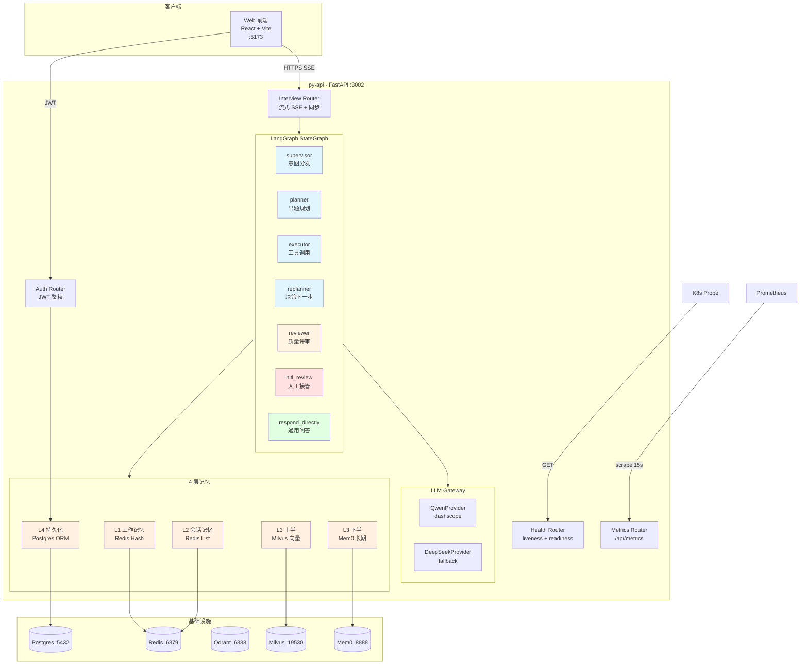
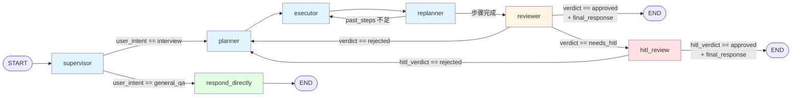
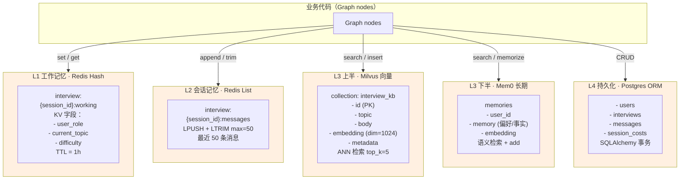
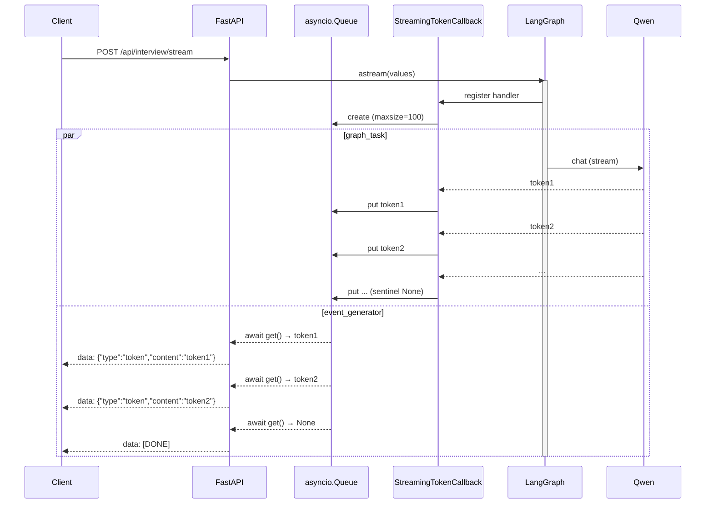

# Architecture · 多 Agent + 4 层记忆

> 2026-06-25 · 单后端 py-api（Python）· LangGraph StateGraph + 4 层记忆分层治理

## 系统架构总览



---

## LangGraph StateGraph · 7 节点 + 4 路由



### 节点职责

| 节点 | 职责 | 输出 |
|------|------|------|
| **supervisor** | 意图识别（interview vs general_qa） | `user_intent` |
| **planner** | 出题规划（基于 `user_role` 岗位匹配） | `plan: List[dict]` |
| **executor** | 工具调用（KB 检索 / LLM 调用 / Mem0 召回） | `past_steps` |
| **replanner** | 决策下一步（继续执行 vs 进入评审） | `retry_count++` |
| **reviewer** | 质量评审（LLM as a judge） | `verdict: approved/rejected/needs_hitl` |
| **hitl_review** | 人工接管（HITL 审核） | `hitl_verdict` |
| **respond_directly** | 通用问答（不走出题流程） | `final_response` |

### State 字段

```python
class InterviewState(TypedDict):
    messages: Annotated[List[BaseMessage], add_messages]
    user_intent: Optional[Literal["interview", "general_qa"]]
    plan: Optional[List[dict]]                          # planner 输出
    past_steps: Annotated[List[dict], lambda x, y: x + y]  # executor 累积
    retry_count: int
    final_response: Optional[str]                       # reviewer approved 后填
    review_score: Optional[float]
    review_issues: Optional[List[str]]
    review_suggestion: Optional[str]
    verdict: Optional[Literal["approved", "rejected", "needs_hitl"]]
    hitl_pending: bool
    hitl_verdict: Optional[Literal["approved", "rejected"]]
    current_specialist: Optional[str]
    user_id: Optional[str]
    user_role: Optional[str]
```

---

## 4 层记忆架构



### 各层职责

| 层 | 存储 | 数据特征 | 用途 | 失效策略 |
|----|------|----------|------|----------|
| **L1** | Redis Hash | KV（user_role / current_topic） | 当前对话上下文 | TTL 1h |
| **L2** | Redis List | 最近 50 条消息 | 短期会话历史 | LTRIM max=50 |
| **L3 上** | Milvus | 1024 维向量（Qwen text-embedding-v3） | 语义检索 KB 题库 | 永久（KB 重新导入） |
| **L3 下** | Mem0 | 用户偏好 / 跨会话事实 | 长期用户画像 | 永久（用户主动删除） |
| **L4** | Postgres | 结构化数据（用户/面试/成本/消息） | 商用持久化 + 报表 | 永久（合规备份） |

### 召回策略（典型场景）

```
用户提问
  ↓
supervisor → planner → executor
  ↓
executor 并行召回：
  ① L1 working state → 当前 role/topic
  ② L2 messages → 最近 5 轮对话
  ③ L3 上 Milvus → KB 题库 top-5（按 query 向量）
  ④ L3 下 Mem0 → 用户偏好 top-3
  ⑤ L4 Postgres → 历史 interview 摘要
  ↓
合并上下文 → prompt → LLM → 出题 / 追问
```

---

## SSE 真流式（2026-06-26）



**关键**：asyncio.Queue 是 async-safe，AsyncCallbackHandler 是 async，可以直接 await put/get。真·流式（LLM 生成一个 token → CallbackHandler 触发 → queue.put → event_generator await → yield → 客户端 SSE 立即收到）。

---

## 商用 best practice 落地（2026-06-26）

| 模块 | 实现 | 触发场景 |
|------|------|----------|
| **结构化日志** | structlog + contextvars + RequestIDMiddleware | 全链路 trace_id |
| **错误处理统一** | AppError + 5 子类（Validation/ResourceNotFound/ExternalService/Business/HITL） | 4xx/5xx JSON |
| **LLM 重试 + 超时** | tenacity 指数退避 1/2/4s × 3 + asyncio.wait_for 30s | 网络抖动 / API 慢 |
| **Docker fail-fast** | docker-compose `${VAR:?msg}` + 应用层 Pydantic model_validator | 启动前缺关键变量 |
| **Rate Limiting** | slowapi：/auth 5/min + /start 10/min + /stream 5/min | 防爆破 / 防占用 |
| **Prometheus Metrics** | /api/metrics：request_total + llm_calls_total + token + cost | Grafana 监控 |
| **SSE 真流式** | asyncio.Queue + StreamingTokenCallback | 边生成边推 |
| **一键部署** | deploy.sh：自动 .env + JWT_SECRET + 等 healthy + 端到端验证 | clone 后 1 行启动 |

---

## 文件结构

```
apps/py-api/
├── app/
│   ├── main.py                     # FastAPI app + lifespan + middleware
│   ├── config.py                   # Pydantic Settings（JWT_SECRET fail-fast）
│   ├── agents/
│   │   ├── graph.py                # LangGraph StateGraph 7 节点
│   │   ├── state.py                # InterviewState TypedDict
│   │   └── nodes/                  # supervisor/planner/executor/replanner/reviewer/hitl/respond
│   ├── llm/
│   │   ├── qwen_provider.py        # dashscope + tenacity + asyncio.wait_for
│   │   └── deepseek_provider.py    # fallback
│   ├── memory/
│   │   ├── redis_memory.py         # L1 工作 + L2 会话
│   │   ├── milvus_memory.py        # L3 上半 向量
│   │   └── mem0_memory.py          # L3 下半 长期
│   ├── db/
│   │   ├── models.py               # L4 SQLAlchemy ORM
│   │   └── session.py              # engine + session factory
│   ├── api/routes/
│   │   ├── auth.py                 # JWT login
│   │   ├── interview.py            # /start (sync) + /stream (SSE 真流式)
│   │   ├── health.py               # liveness + readiness
│   │   └── metrics.py              # /api/metrics (Prometheus)
│   └── core/
│       ├── middleware.py           # RequestIDMiddleware
│       ├── exceptions.py           # AppError + 5 子类
│       ├── rate_limit.py           # slowapi
│       └── metrics.py              # prometheus_client
├── tests/                          # 74 case（9 文件 + conftest + pytest.ini）
├── requirements.txt                # 38 依赖（langchain 0.3.27 / langgraph 0.5.4）
├── Dockerfile                      # 多阶段 + non-root USER
└── pytest.ini                      # asyncio_mode=auto
```